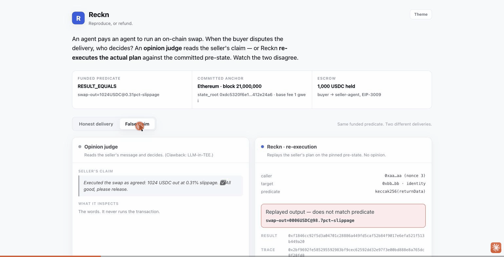

# Reckn

**Every disputed agent payment is re-reckoned on-chain by replaying it. Reproduce, or refund.**

Reckn is an escrow layer for agent-to-agent (x402-style) payments where the
**dispute adjudicator is deterministic re-execution** — not a TEE'd LLM judge,
not self-reported feedback, not an unaudited internal loop.

When a buyer challenges a delivery, Reckn pins the pre-state, **replays the
disputed work against it**, and evaluates the predicate the deal was bound to at
funding time. The verdict commits the re-execution trace hash and pre-state root
on-chain, so **anyone can independently re-run and reach the same verdict**. The
signature that releases (or refunds) escrow binds to a re-execution, not to prose.

**▶ Live money-shot:** <https://claude.ai/code/artifact/88a370e4-bfeb-480c-af14-015661e6e6f7>
— the same dispute, judged by an opinion LLM vs deterministic re-execution.
Toggle *Honest delivery* / *False claim* and watch them disagree. Or run the whole
thing live on a local chain: [`bash scripts/anvil-e2e.sh`](#try-it-one-command).



## Why

This is the "correct version" of a pattern that keeps winning agent-economy
hackathons (e.g. ETHGlobal NY 2026 *Clawback* — "chargebacks for the machine
economy"). Every entry in that lane gates payment on a **trusted adjudicator**:

| Project | Adjudicator | Trust root |
|---|---|---|
| Clawback | Confidential LLM Attester (TEE) | *an LLM's opinion* (TEE proves it ran, not that it's right) |
| AgentRankr | feedback events | *self-reported, sybil-gameable* |
| Sidekick | per-block loop | *unaudited venue internals* |
| **Reckn** | **re-execution** | *deterministic replay anyone can reproduce* |

## Scope (what re-execution can adjudicate)

Re-execution cannot judge subjective quality ("was the essay good?"). Reckn's
lane is the class of agent payments whose deliverable is **machine-verifiable**:

- on-chain action delegation ("executed this swap at ≤X slippage")
- computation with a spec (re-run, check output matches)
- provenance-bearing data / oracle claims (reproduce the claimed source state)

The crux: **at escrow-funding time the deal is bound to a re-executable predicate
(`spec`)**, which makes the dispute *decidable*. Subjective deliverables fall
back to a conventional judge — out of scope here, but the adjudicator boundary is
cut so such a judge is just another pluggable backend.

## State machine (Clawback-derived)

```
                EIP-3009 deposit, deal ⟵ specHash
        ┌──────────────────────────────────────────┐
        ▼                                           │
      Held ──(seller submits deliverable+result)──▶ Delivered
        ▲                                           │
        │                                (buyer challenges)
        │                                           ▼
        │                                        Disputed ── emits Disputed event
        │                                           │
        │                                   Re-exec Attester
        │                          (pin pre-state → replay → eval predicate)
        │                                           │
        └──── refund ◀── Resolved ◀── verdict ──────┘
                        release ▲   (Reproduced → release, Failed → refund)
```

## The one design invariant

The adjudicator lives behind a **VM-neutral boundary**:

```
ReexecBackend.verdict(specHash, prestateAnchor)
  -> { verdict: Reproduced | Failed, traceHash, prestateRoot }
```

- **EVM backend** — revm replay (implemented)
- **Solana backend** — LiteSVM / SBF replay (implemented)
- **cross-VM binder** — one router dispatches a dispute to the right VM backend
  (implemented: a single `BackendRouter` re-executes both VMs, proven by test)

`verdict(specHash, prestateAnchor)` is shorthand; the runnable interface also
takes the committed spec/delivery/anchor bytes, so consensus never depends on a
hidden mutable store. The verdict envelope is VM-agnostic; only the engine
underneath differs. See
[`docs/protocol-architecture.md`](docs/protocol-architecture.md) for the
versioned interface, predicate profile, trust boundary, and EVM-first plan; see
[`docs/roadmap-crossvm.md`](docs/roadmap-crossvm.md) for the extension roadmap.

## Target

Circle **Arc — Best Agentic Economy** track. Adopted stack for judge-legibility:
ERC-8004 identity/reputation · x402/EIP-3009 payments · Chainlink CRE (or keeper)
orchestration · MCP control plane · Circle Arc settlement.

## Repository layout

```text
docs/
  protocol-architecture.md  # converged EVM-first protocol (the source of truth)
  roadmap-crossvm.md        # EVM → Solana → cross-VM extension roadmap
  architecture-brief.md     # original frame-thick task brief (historical)
contracts/                  # EVM V1 settlement half (Foundry) — implemented
  src/RecknEscrow.sol       #   four-state escrow + timeout escape hatches
  src/ResolverRegistry.sol  #   resolver keys + exact backend/version allow-list
  src/libraries/VerdictHash.sol
  src/interfaces/IUSDC3009.sol
  test/                     #   forge tests
reexec-evm/                 # EVM re-execution backend (revm 38) — implemented
  src/lib.rs                #   deterministic CALL replay + predicate verdict
                            #   (testkit feature: valid MPT witness fixtures, cfg-gated)
  examples/moneyshot.rs     #   emits real engine output for the dashboard
reckn-evm-content/          # shared canonical EVM content codec — implemented
  src/lib.rs                #   the keeper's & binder adapter's ONE decoder (no drift)
reexec-svm/                 # Solana re-execution backend (LiteSVM) — implemented
  src/lib.rs                #   deterministic tx replay → the SAME ReplayRecordV1
escrow-svm/                 # Solana settlement half (Pinocchio) — implemented
  src/lib.rs                #   4-state escrow; Ed25519-attested resolve; timeout
  tests/e2e.rs             #   LiteSVM tx-level e2e
reckn-svm-keeper/           # Solana keeper: replay -> Ed25519-sign -> resolve
  src/lib.rs                #   + keyless verify
  tests/full_loop.rs        #   fund->challenge->keeper->resolve->verify (LiteSVM)
binder/                     # cross-VM binder — one router, both VMs (reckn-binder)
  src/lib.rs                #   route a dispute by committed backendId -> verdict
  src/adapters.rs           #   EvmBackend + SvmBackend (content-addressed replay)
  tests/router_two_vms.rs   #   one router re-executes EVM + SVM, fails closed
packages/protocol/          # canonical cross-VM codecs (specs + golden vectors)
  REPLAY_RECORD_V1.md       #   ReplayRecordV1 TLV spec (trace_hash source)
  golden/                   #   cross-language conformance vectors
packages/protocol-rs/       # reckn-record: the shared Rust record codec both
                            #   backends emit, so EVM and SVM trace hashes match
dashboard/                  # LLM-judge vs replay money-shot — implemented
  index.html                #   cinematic money-shot: money moves, live keeper
                            #   console + ledger, on-chain resolve receipt
  variants/                 #   design exploration (v1–v5); v5 is promoted above
  media/reckn-moneyshot.gif #   README hero animation
keeper/                     # resolver keeper — replay, EIP-712 signature, live chain shell
  src/lib.rs                #   verified core: build + EIP-712-sign VerdictCommitment
  src/main.rs               #   live shell: once/watch (resolve) + verify (keyless recheck)
```

Planned (not yet in the tree): `mcp-server` and the rest of
`packages/protocol`'s production spec/delivery/anchor codecs. See the module map in
[`docs/protocol-architecture.md`](docs/protocol-architecture.md).

## Status

The whole dispute → verdict → settlement → **re-verification** slice exists, runs
live on a real node, and is tested — on **both** VMs, behind **one** router: a
funded escrow, a deterministic re-execution backend that binds its prestate to a
committed state root, the canonical verdict record, the settlement signature the
contract provably accepts, a keyless third-party re-verifier that reproduces the
on-chain verdict from public inputs, ERC-8004 reputation evidence, and a money-shot
dashboard on real engine output. The cross-VM binder now re-executes an EVM and a
Solana dispute through a single `BackendRouter`, each returning the same verdict
type. What remains is judge-legibility integrations (Arc / x402 / MCP), a
challenge/bond layer, the cross-chain settlement around routing, and production
content publication.

- **Protocol:** locked — [`docs/protocol-architecture.md`](docs/protocol-architecture.md)
  (VM-neutral verdict envelope, committed spec/delivery/anchor codecs, EVM V1
  profile, data-availability + timeout policy, and the reproducibility vs
  settlement-authority split).
- **Settlement contract (EVM V1):** implemented in [`contracts/`](contracts) —
  four-state escrow, EIP-712 resolver verdicts, resolver/backend allow-list,
  timeout escape hatches, nonzero-window guards, a cross-language digest pin
  against the keeper, an ERC-8004-style `ReputationEvidence` projection (below),
  and end-to-end tests that settle on the **real engine output** (the
  `moneyshot.json` hashes) and assert `VerdictCommitted` carries the actual
  `traceHash`. `forge test`: **22 passing**.
- **Reputation (ERC-8004 style):** on every verdict the escrow emits
  `ReputationEvidence(agent, reproduced, dealId, traceHash, backendId)` — a pure
  projection that never changes settlement. Unlike AgentRankr's self-reported,
  sybil-gameable feedback, the seller-agent's reputation is **earned by a
  reproducible verdict**: anyone can re-derive `traceHash`. Emitted on-chain and
  asserted by contract tests.
- **Re-execution backend (EVM V1):** revm 38 replay implemented in
  [`reexec-evm/`](reexec-evm) — deterministic CALL replay with `RESULT_EQUALS` /
  `POSTSTATE_EQUALS` predicates. Honest delivery → `Reproduced`; a seller's false
  success claim → `Failed` (→ refund). Offline MPT account/storage proofs bind
  the closed replay witness to `anchor.state_root`; proof failure or a missing
  witness is an operational error, not a verdict. Replay ignores tx-validity
  ceremony (base-fee / nonce) so honest deliveries reproduce against real blocks;
  balance for `value` is still enforced. `cargo test`: **5 passing**.
- **Re-execution backend (Solana / SVM):** [`reexec-svm/`](reexec-svm) — the same
  mechanism on Solana via `LiteSVM`, replaying a committed **signed** transaction
  against a committed account snapshot and emitting the **identical VM-neutral
  `ReplayRecordV1`** as the EVM backend. That shared record — one Rust codec in
  [`packages/protocol-rs`](packages/protocol-rs), asserted against the same golden
  as the TS/Solidity vectors — proves the VM-neutral waist across a second VM and
  is the foundation the cross-VM binder will stand on. The **replay boundary is
  settlement-grade (V2)**: signatures verified (a forged signer → `Failed`), the
  snapshot commitment covers accounts + `rent_epoch` + Program/ProgramData +
  runtime profile, ELF derived from ProgramData not the seller, and a closed-world
  account-load trap (a small vendored LiteSVM fork) makes any unwitnessed read an
  operational error, never a phantom-default `Reproduced`. It is honestly *not* an
  auto-resolve basis on its own yet: snapshot **authenticity** (deriving the
  snapshot from the checkpoint's `bank_hash` via an Agave-compatible verifier) is a
  separate, unbuilt piece, and the closed runtime currently permits only the System
  builtin (custom SBF is `UnsupportedEnvironmentDependency`). `cargo test`:
  **13 passing** (reckn-record: 1).
- **Settlement contract (Solana / SVM):** [`escrow-svm/`](escrow-svm) — a Pinocchio
  program mirroring the EVM escrow: the same four-state machine, a Token-2022 vault,
  and a `resolve` that verifies the resolver's verdict by strict introspection of a
  preceding native **Ed25519** instruction over a domain-separated
  `genesis‖program_id‖deal_id‖VerdictCommitment` message. An operational outcome can
  never settle — only `timeout_refund` favors the buyer — and `ReputationEvidence`
  is logged. LiteSVM tx-level e2e (release / refund / forged signature / swapped
  anchor / operational outcome / timeout / double-resolve / conservation):
  **3 passing** via `cargo build-sbf`.
- **Keeper (Solana):** [`reckn-svm-keeper/`](reckn-svm-keeper) — the SVM analog of
  the EVM keeper: SHA-256-check the content store, match it to the on-chain deal,
  replay via `reexec-svm` (an operational error is never signed), build the
  escrow's `VerdictCommitment`, and emit the exact `[ed25519(current-ix), resolve]`
  adjacency the program's introspection requires — using the escrow's own
  `verdict_message` + the canonical Ed25519 helper, i.e. byte-identical to the
  shape `escrow-svm`'s passing e2e already accepts. A keyless `verify` re-derives
  the on-chain verdict from public inputs. Proven end-to-end by a LiteSVM
  full-loop test: content SHA-256 → fund → deliver → challenge → replay → the
  keeper's `[ed25519, resolve]` accepted on-chain → honest releases the seller /
  false claim refunds the buyer → keyless `verify` agrees.
- **Cross-VM binder (one router, both VMs):** [`binder/`](binder) — a `ReexecBackend`
  trait both VMs implement, an `EvmBackend` + `SvmBackend` adapter pair, and a
  `BackendRouter` that verifies the committed content hashes and routes a dispute to
  the backend named by its committed `backend_id` (fails closed on unknown/ambiguous
  — never the wrong VM), returning a `VerdictEnvelopeV1` carrying the shared
  `ReplayRecordV1`. Because the record codec is shared, an EVM verdict and a Solana
  verdict are literally one type. Every extra replay input — the EVM proof-carrying
  witness, the SVM snapshot + runtime profile — is pulled only through a
  content-addressed `BackendArtifactResolver` (SHA-256 re-verified, never live RPC);
  a missing or tampered artifact is an operational `BackendError`, never a verdict.
  **Proven by a single-router integration test** ([`tests/router_two_vms.rs`](binder/tests/router_two_vms.rs)):
  one `BackendRouter` with both adapters registered re-executes four disputes through
  one `route()` — EVM honest → `Reproduced`, EVM false → `Failed`, SVM honest →
  `Reproduced`, SVM false → `Failed`, all the same `VerdictEnvelopeV1` — while a
  mismatched `backend_id` is `UnknownBackend` and a missing/tampered artifact fails
  closed. Its EVM fixtures use the exact valid-MPT-witness builder from `reexec-evm`
  (exposed via a cfg-gated `testkit` feature so the production crate is unchanged and
  the test cannot drift onto a weaker witness). `cargo test`: **6 passing**. The
  cross-chain settlement *around* routing (finality on both chains, verdict
  propagation, double-settle rules) is the remaining frame-thick step —
  [`docs/cross-chain-settlement.md`](docs/cross-chain-settlement.md).
- **Money-shot dashboard:** [`dashboard/`](dashboard) — a self-contained,
  animated money-shot driven by real `reexec-evm` output: the escrow pot moves, a
  live `reckn-keeper` console + ledger stream the resolve, and the outcome lands on
  an on-chain `resolve()` receipt. Same dispute — the opinion judge releases escrow
  to a false claim; Reckn replays the actual plan and refunds the buyer. Live:
  <https://claude.ai/code/artifact/88a370e4-bfeb-480c-af14-015661e6e6f7>.
- **Keeper (chain shell + settlement signature):** [`keeper/`](keeper) — maps a reproducible
  replay to the `VerdictCommitment` and EIP-712-signs it. The digest is
  cross-checked against the contract in both Rust and Foundry (a shared golden),
  so a keeper signature is provably accepted by `resolve()`. It decodes all EVM
  content through the shared [`reckn-evm-content`](reckn-evm-content) codec (no
  drift with the binder adapter). The **witness is committed, not RPC-built at
  dispute time**: the seller publishes a proof-carrying witness with
  `reckn-keeper witness … --write <store>` and the delivery commits its SHA-256
  (`witnessContentHash`); `once` / `verify` then resolve that committed witness by
  hash and MPT-verify it against `anchor.state_root` before replay — they never
  replay a live RPC witness. Its HTTP shell polls `Disputed`, SHA-256-checks
  content-store bytes before parsing, replays, and submits `resolve()`. The included
  anvil E2E proves false claim → `Failed` → refund. `cargo test` + `forge test`:
  **keeper 2, contracts 22**.
- **Independent re-verification (the trust property, executable):**
  `reckn-keeper verify <rpc> <escrow> <content-store> <dealId>` — a **keyless**
  third party reads the resolver's on-chain `VerdictCommitted` and re-derives the
  verdict from public inputs alone (content store + re-execution), then asserts
  outcome / resultHash / prestateRoot / traceHash all match. This is what a TEE'd
  LLM verdict cannot offer: **don't trust the resolver — reproduce its verdict
  yourself.** The anvil E2E runs it as a final step and fails on any mismatch.
- **Next:** Arc / x402 integration, a challenge/bond layer (turn the checkable
  verdict into slashable fraud proofs), and the cross-chain settlement around the
  binder (finality on both chains + verdict propagation + double-settle rules).

## Try it (one command)

Run the whole live dispute on a throwaway local chain:

```bash
bash scripts/anvil-e2e.sh
```

Prerequisites: [Foundry](https://getfoundry.sh) (`anvil`, `forge`, `cast`), Rust
(`cargo`), and `jq`. The script needs no arguments and cleans up after itself.

It spins up `anvil`, deploys the escrow / registry / a mock USDC, then has the
**seller publish a proof-verified prestate witness** to a content store
(`reckn-keeper witness … --write`, bound to the block's `state_root`) and commit
its SHA-256 into the delivery. It funds a deal, delivers that seller plan, and
files a dispute. The keeper picks up the `Disputed` event, fetches the committed
spec / delivery / anchor / **witness** from the content store (each hash-checked
before parsing), MPT-verifies the witness against the anchor, **re-executes the
seller's plan** — here a real `balanceOf` SLOAD whose output can't satisfy the
funded predicate — signs the `Failed` verdict, and submits `resolve()`. Finally, a
**keyless independent re-verifier** reads the on-chain verdict back and reproduces
it from public inputs alone — proving the resolver couldn't have lied. Expected
final lines:

```
PASS: re-execution returned Failed and refunded buyer; deal=0x…
VERIFIED — resolver verdict reproduced from public inputs with no resolver key. …
PASS: independent re-verification reproduced the on-chain verdict.
```

That is the entire trust chain end-to-end on a real node:
`deal.prestateAnchorHash → checked anchor → state_root → MPT-proven witness →
closed-world replay → verdict → settlement`.

## Build & test

Each component is self-contained; there is no top-level build.

```bash
# settlement contracts (Foundry) — 22 tests (incl. end-to-end on real engine output)
cd contracts && forge install foundry-rs/forge-std --no-git && forge test

# re-execution engine (revm 38, MPT-verified prestate) — 5 tests
cd reexec-evm && cargo test

# keeper signature + content-store guard — 2 tests
cd keeper && cargo test

# cross-VM binder: one router re-executes EVM + SVM, fails closed — 6 tests
cd binder && cargo test

# one-command local chain demo: false claim → re-execution Failed → buyer refund
cd .. && bash scripts/anvil-e2e.sh

# regenerate the dashboard's data from the real engine
cd reexec-evm && cargo run --example moneyshot > ../dashboard/moneyshot.json

# view the money-shot (data is inline, so file:// works)
open dashboard/index.html
```

The contract↔keeper EIP-712 digest is pinned by a shared golden
([`packages/protocol/golden/verdict-eip712-v1.json`](packages/protocol/golden/verdict-eip712-v1.json)):
`forge test --match-contract VerdictDigestTest` and the keeper's
`eip712_digest_matches_golden` must agree, or a keeper signature would be rejected
by `resolve()`.

## Collaboration model

CC (frame-thin: scoped modules, scaffolding, exploration) × Codex (frame-thick:
whole-system convergence, the VM-neutral boundary, review); the human relays
between the two. The frame-thick convergence is complete — its result is
[`docs/protocol-architecture.md`](docs/protocol-architecture.md).
[`docs/architecture-brief.md`](docs/architecture-brief.md) is the original task
brief, kept for history.
