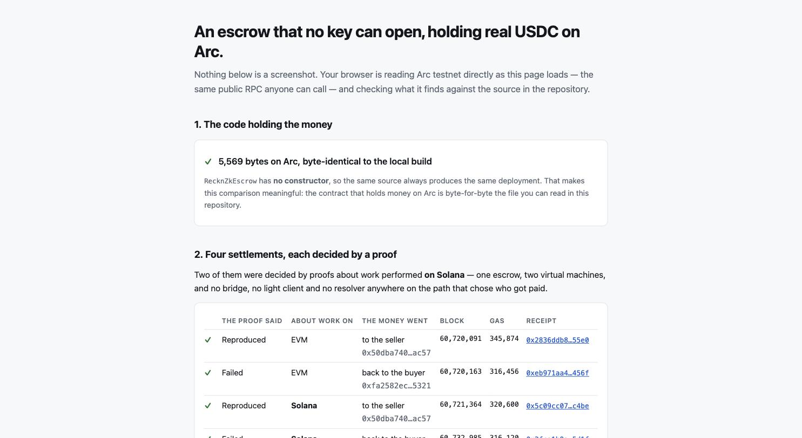
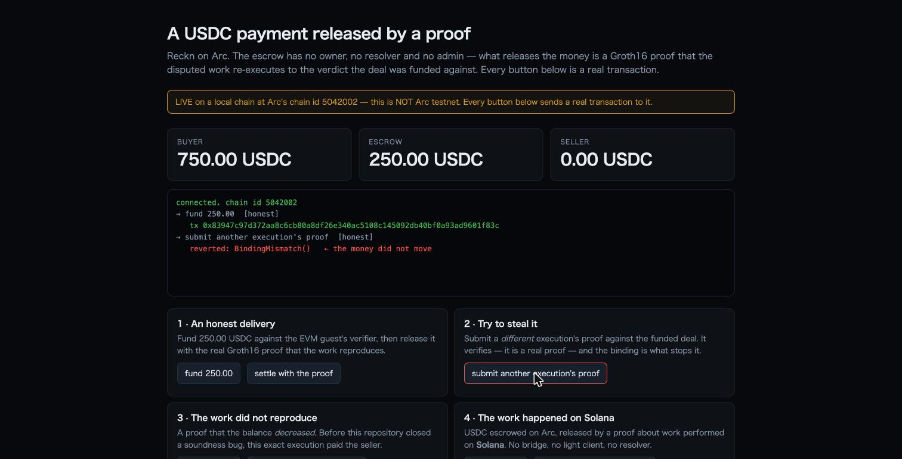
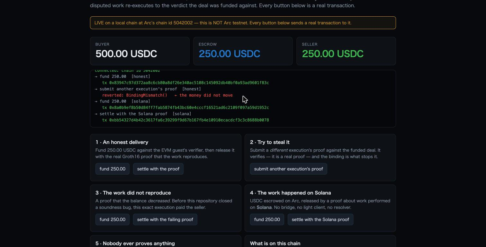
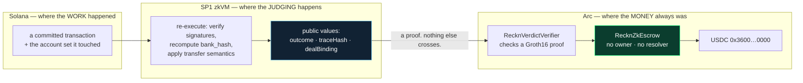

# Reckn

## Keep assets native. Settle on proof.

**Reckn is building the standard for proof-driven settlement across execution environments.**
Agents may choose where work happens. Assets remain native.
Reproducible execution decides payout.

*`building`, not `is` — [`docs/positioning.md`](docs/positioning.md#what-a-standard-would-have-to-fix)
names the five boundaries a standard would have to fix, and marks the one that is still open.*

An escrow that releases only when the work it was funded against can be **re-executed and
reproduced** — and refunds the buyer when it cannot. The money never leaves the chain it was
funded on: a proof crosses, the asset does not.

No owner, no resolver, no admin, no upgrade path. **Reproduce, or refund.**

---

**This page is long because it is the evidence, not the pitch.** Jump to what you came for:

| you want to | go to |
|---|---|
| **use it with your own service** | **[`docs/use-with-your-service.md`](docs/use-with-your-service.md)** — the whole integration in one page |
| understand the idea | [The problem](#the-problem) · [What Reckn does instead](#what-reckn-does-instead) · [Why](#why) |
| see how it compares | [`docs/positioning.md`](docs/positioning.md) — bridges, oracles, TEEs, x402: which layer decides what · [`docs/chain-fit.md`](docs/chain-fit.md) — why Arc and why Tempo are different answers |
| know what it can decide | [Scope](#scope-what-re-execution-can-adjudicate) · [The one design invariant](#the-one-design-invariant) |
| check the claim yourself | [The claim is a build condition](#the-claim-is-a-build-condition-not-a-promise) · [What crosses, and what does not](#what-crosses-and-what-does-not) |
| run it in ten minutes | [Try it (one command)](#try-it-one-command) |
| see what is *not* done | [`docs/status.md`](docs/status.md) — `Known gaps (not closed)` |
| find any other document | [`docs/README.md`](docs/README.md) — what each page is *for* |
| judge the ETHOnline entry | [Where the boundary is](#ethonline-2026--where-the-boundary-is) · [`docs/ethonline-2026/`](docs/ethonline-2026/) |

---

## The problem

In an agent economy the money and the work are rarely on the same chain. That splits one
payment into two questions, and **today a party with a key answers both**:

- **Was the work actually done?** — an operator inside a TEE, a bonded resolver, a quorum of
  voters. Each is per-chain: you redeploy the judge and re-earn its reputation on every chain
  your agent touches.
- **How does the asset get to where it is owed?** — a bridge.

So the asset's fate is decided by two parties that **were never asked the question**: a judge
who was told the answer, and a bridge whose job is to move value, not to know whether it was
earned. Both are doing their own work correctly. The seat that is empty is the one that decides.

## What Reckn does instead

Do not move the asset to reach the work. **Move a proof of the work to reach the asset.**

The buyer escrows the stablecoin **on the chain it already lives on**. The seller does the
work wherever the work belongs. When the delivery is disputed, the execution is **replayed**
against the pre-state the deal pinned. If it reproduces, the escrow releases to the seller.
If it does not, the buyer is refunded.

**This is for deterministic, high-value work — not a way to grade arbitrary AI output.** What
re-execution can settle is a claim that is recomputable from committed inputs: *this call, over
this pre-state, moved this number by at least this much*. "Was the summary any good" is not that,
and no amount of integration makes it that — see
[`docs/use-with-your-service.md` §1](docs/use-with-your-service.md) for the one-minute version and
[Scope](#scope-what-re-execution-can-adjudicate) for the reasoning.

> ### Keep assets native. Settle on proof.
>
> *Don't make a bridge decide where money goes. Make proof decide.*

Three things follow, and each is checkable rather than asserted:

| | | where it is checked |
|---|---|---|
| **Nobody decides.** | No owner, admin, resolver, pause or upgrade path — and that is a **build condition**, not a promise. | `scripts/no-keys.sh` fails the build if one appears |
| **Nothing crosses but a proof.** | The USDC is on Arc before the dispute and on Arc after it. Arc never runs a Solana VM. | [What crosses, and what does not](#what-crosses-and-what-does-not) |
| **It is running.** | Four settlements on Arc testnet moved real USDC. **Two were decided by proofs about work performed on Solana.** | the live page reads them from the chain |

**And what it does not do**, said here rather than in a footnote. It does not remove the need
to hold funds on the chain you pay from — what it removes is moving them *in order to be
judged*, not *in order to pay*. And it does not prove those Solana inputs came from mainnet:
the guest recomputes a bank hash over the account set **the deal named**, which is
consistency, not provenance. There is a test that says so, and a panel on the live page that
says so to a judge.

Positioning against the adjudicator-based alternatives is in [Why](#why); the full boundary
is in [What crosses, and what does not](#what-crosses-and-what-does-not); the wording this
project holds itself to, including the claims it refuses to make, is in
[`docs/messaging.md`](docs/messaging.md).

---

### Open this and your browser checks Arc for you — nothing to install

**→ [psyto.github.io/reckn/money-shot.html](https://psyto.github.io/reckn/money-shot.html)**
— one dispute, judged two ways: an opinion model approves a false claim, a replay overrules
it, and the money goes back to the buyer.

**→ [psyto.github.io/reckn](https://psyto.github.io/reckn/)** — and then the receipts: your
browser compares the deployed bytecode against this source and reads four settlements off Arc
testnet. No install, no wallet.

[](https://psyto.github.io/reckn/)

**And it lets you try to break the claim yourself.** Type anything you like into it —
argue, insist, paste an instruction telling the system to approve — and watch the hash of
your words change on every keystroke while the `dealBinding`, the proof's `traceHash` and
the verdict, all read live from Arc, do not move. Prose is real and it is recorded. It is
simply not something the verdict is a function of.

One page, no server, no wallet, no clone. It calls Arc's public RPC from *your* browser
and checks three things in front of you: that the bytecode holding the money is
byte-identical to the source in this repository (`RecknZkEscrow` has no constructor, so
the same source always produces the same deployment); that four settlements really
happened, with the verdict and the recipient **decoded out of the receipts** rather than
printed from the page; and that one deal is still funded and frozen — with the refund
path that will return it. The page is generated from
[`zk-verdict/contracts/arc.json`](zk-verdict/contracts/arc.json) and forge's build
output, so no hash on it is typed by hand.

### Try to steal the money. It is a button.



```bash
bash scripts/arc-demo.sh        # then open http://127.0.0.1:8787
```

**And it is live on Arc testnet.** Not "deployment-ready" — deployed, and it has moved
money: a real Groth16 proof released **1.000000 USDC** to a seller, and a proof that
the balance *decreased* refunded the buyer, both on chain 5042002.

| | |
|---|---|
| `RecknZkEscrow` | [`0x580f2c32…5669`](https://testnet.arcscan.app/address/0x580f2c3268b0a13bf46c6d381bf807cbf1595669) — no owner, no constructor |
| `RecknVerdictVerifier` | [`0xc5f45b9d…97b7`](https://testnet.arcscan.app/address/0xc5f45b9dec0f0b00a1493c63c0204c8c920197b7) |
| `SP1Verifier` (Groth16, fixed) | [`0xc84a89a5…5fbb`](https://testnet.arcscan.app/address/0xc84a89a576f4c735191f4db484a5d5602c175fbb) |
| **released to the seller** | [`0x2836ddb8…055e0`](https://testnet.arcscan.app/tx/0x2836ddb83141f3094b4ff055c154fba41d13c74dbe35f21e41a3001e6ef055e0) — block 60,720,091, 345,874 gas |
| **refunded to the buyer** | [`0xeb971aa4…9456f`](https://testnet.arcscan.app/tx/0xeb971aa45cce8c04e9a231d67d2737a28c4b637cbef74d46d1a465f01b59456f) |
| **released by a *Solana* proof** | [`0x5c09cc07…2c4be`](https://testnet.arcscan.app/tx/0x5c09cc0772fcfe23acbc9ea5752bd2380bceef1076ce7fc188fc5b2fdc02c4be) — block 60,721,364. **USDC on Arc, moved by a proof about work performed on Solana** |
| **refunded by a *Solana* proof** | [`0x3fca1b9a…65d1f`](https://testnet.arcscan.app/tx/0x3fca1b9ad6702812fcb52db7e6ed07a42cb97ced6aec5cfd8840326a70065d1f) — the Solana transfer credited below the floor, so the buyer got the USDC back |

The USDC is Circle's own predeploy at `0x3600…0000`, so the escrow holds the chain's
native money — no wrapper, and no change to the contract to make that work.

Five buttons, five real transactions against a local chain at Arc's chain id:

| press | what happens |
|---|---|
| **fund 250.00 USDC**, then **settle with the proof** | a conditional stablecoin payment, released by a Groth16 proof and by nothing else |
| **submit another execution's proof** | it *verifies* — it is a real proof — and `BindingMismatch()` stops it. **The money does not move** |
| **settle with the failing proof** | a proof that the balance **decreased** refunds the buyer |
| **settle with the Solana proof** | **USDC on Arc, released by a proof about work performed on Solana.** No bridge, no light client, no resolver |
| **refund now** → **wait 30 days** → **refund** | `TooEarly()`, then *anyone* may return the money to the buyer — and the caller gets nothing for it |

Everything else in this README is the argument for why those five buttons behave that
way, and what is still **not** true ([the gaps are listed](docs/status.md#known-gaps-not-closed),
not buried).

---

Reckn is an escrow layer for agent-to-agent (x402-style) payments where the
**dispute adjudicator is deterministic re-execution** — not a TEE'd LLM judge,
not self-reported feedback, not an unaudited internal loop.

When a buyer challenges a delivery, Reckn pins the pre-state, **replays the
disputed work against it**, and evaluates the predicate the deal was bound to at
funding time. The verdict commits the re-execution trace hash and pre-state root
on-chain, so **anyone can independently re-run and reach the same verdict**. The
signature that releases (or refunds) escrow binds to a re-execution, not to prose.

That re-execution now also runs **inside a zkVM**: a real Groth16 proof that the
committed work reproduces the verdict — **EVM (`revm`) or Solana (System transfer),
each against a cryptographically authenticated prestate** (MPT vs `state_root` /
`bank_hash` lattice) — is **verified on-chain by one generic verifier**, and that
proof **settles escrow directly** ([`RecknZkEscrow`](zk-verdict/contracts/src/RecknZkEscrow.sol)):
`Reproduced` releases to the seller, `Failed` refunds the buyer, **with no resolver
at all** — the proof carries its own authority. The EVM guest runs **real `revm`
over the seller's committed CALL** against an MPT-proven prestate (406,715 cycles);
the Solana guest is the narrower slice — a `bank_hash`-authenticated System
transfer (986,097 cycles).

**One escrow settles both.** The adjudicating program is named by the funder per deal
and pinned by its codehash, so a single `RecknZkEscrow` — with **no constructor and no
`immutable`**, meaning every deployment of that source is the same contract — settles
an EVM proof and a Solana proof side by side. No resolver, no bridge, and no light
client on the adjudication path. The funder chooses the program; the proof, checked by
that program, chooses the payout. Scope and limits are stated honestly in
[`zk-verdict/`](zk-verdict), including what is **not** closed
([in `docs/status.md`](docs/status.md#known-gaps-not-closed)).

**▶ Why it matters, in twenty seconds:** the same dispute, judged by an opinion LLM
and by deterministic re-execution, **watching them disagree** — the animation below is
driven by real `reexec-evm` output. Open [`dashboard/index.html`](dashboard/index.html)
locally to toggle *Honest delivery* / *False claim* yourself (the data is inline, so
`file://` works), or run it live on a throwaway chain:
[`bash scripts/anvil-e2e.sh`](#try-it-one-command). **That page is the hook; the
buttons above are the check.**

**▶ ZK money-shot:** [`dashboard/variants/`](dashboard/variants) — watch a disputed
payment get **re-executed inside a zkVM → proven → verified on-chain
→ settled on the proof alone**, on EVM or Solana (real fixture data). Flip *tamper
prestate* and the pipeline is rejected: no proof, no settlement. One command:
[`bash zk-verdict/scripts/zk-e2e.sh`](zk-verdict/scripts/zk-e2e.sh).


**▶ USDC on Arc, released by a proof about work on Solana** — the same page, further
down. The deal names the Solana guest's verifier; the escrow never learns which
virtual machine the work happened on.



**The same escrow source, unmodified, now settles on a second payment chain** — and that
is a statement about the *source*, checked by a gate (`zk-verdict/scripts/tempo-arc-parity.sh`),
not a claim that the two chains adjudicate alike. They do not: the adjudicator is named per
deal by the funder, and a TIP-20 can be paused or policy-gated where Arc's USDC cannot. On **Tempo
testnet** (2026-09-08) the escrow held **PathUSD** — a real TIP-20, not a mock — and a proof
about work performed on Solana released it to the seller, while a proof that the work did not
reproduce refunded the buyer. Tempo has no gas token, so the fee that settled each of those
was paid in **the same stablecoin the escrow was holding**, read off the receipts' own
`feeToken`. Explorer-linked hashes:
[`docs/specs/011-tempo-tip20-slice.md`](docs/specs/011-tempo-tip20-slice.md) §10.

**→ [psyto.github.io/reckn/tempo.html](https://psyto.github.io/reckn/tempo.html)** — the
same idea as the Arc page, for the second chain: *your* browser calls Tempo's public RPC and
checks it in front of you. Nothing on it is passed in but addresses and transaction hashes —
the page calls `deals()` on the escrow, reads the settlement receipts, and works out the
verdict, the recipient and the fee token itself. It also shows the deal that a real proof of
a *different* execution failed to settle: still funded, money still in the escrow, no
transaction to link because it never reached a block.

Four of the checks behind that page read the live chain rather than this repository:
`tempo-verify.sh` re-derives every outcome from receipts instead of trusting the run that
produced them (the deal ids come out of the `Funded` events, not from a terminal),
`tempo-receipts.sh` requires every recorded hash to exist on chain with the status the
record claims — **including the one that failed**, which is recorded rather than hidden —
`tempo-arc-parity.sh` is the gate behind the sentence above, and `tempo-page-check.sh` runs
that page's own JavaScript against Tempo and fails if what it renders is not true. The page
said *"Nothing is deployed to Tempo"* for several hours after the escrow was deployed and had
settled twice; that check exists so it cannot happen twice.

Everything else on this page is Arc. **This is not claimed as ETHOnline event work** — see
[`docs/ethonline-2026/PREFLIGHT.md`](docs/ethonline-2026/PREFLIGHT.md) §2.

**▶ Demo video — the ETHOnline submission (3:52, 1920×1080, narrated):**
[`dashboard/media/Reckn_ETHOnline_20260909.mp4`](dashboard/media/Reckn_ETHOnline_20260909.mp4)
— the deck's four checks, each one answered by the live page driving a real chain, ending on
this run's own `no-keys.sh` output, with a **human English voice-over**. No synthetic voice was
used anywhere. `docs/ethonline-2026/PREFLIGHT.md` measures it against the event's requirements
and it now clears all six.

The **silent master** it was cut from is
[`dashboard/media/reckn-demo-v3.mp4`](dashboard/media/reckn-demo-v3.mp4) (3:57). It is **not
the same picture**: the narrated file runs 5.8 s shorter and, from roughly 3:10 onward, ahead
of the master. Re-recording the master will not reproduce the submission, and it is not meant
to — the script it is timed against is [`dashboard/video/VO.md`](dashboard/video/VO.md).
The earlier v2 film (`reckn-arc-demo-v2.mp4`, 3:04, and a no-cards cut at 3:03) and the v1
files are kept for comparison and are not the submission.
Regenerate it with `cd dashboard/video && npm install && node record.js`; the recorder
asserts each step's result and refuses to record one that did not happen.

**▶ Demo video, pre-event cut (35s):**
[`dashboard/media/reckn-demo-full.mp4`](dashboard/media/reckn-demo-full.mp4)
— a self-explanatory 35s cut with title cards (no audio needed): the hook (agent
payments settle on a trusted judge you can't check) → the money-shot judged two ways
(false → refund, honest → release) → **live `anvil-e2e.sh` on a real chain** (pin the
anchor, publish the witness, re-execute, refund, reproduce the verdict keyless) → the
close (*one engine, any chain, any rail*). Component clips:
[`reckn-demo.mp4`](dashboard/media/reckn-demo.mp4) (dashboard),
[`reckn-e2e.mp4`](dashboard/media/reckn-e2e.mp4) (terminal).

## The claim is a build condition, not a promise

> **No key can judge.**

Every competing design in this lane has *someone holding a key* — a TEE operator,
a bonded resolver, a voting set. Reckn's zk path has none: `RecknZkEscrow` has no
owner, admin, resolver, pause or upgrade, and `settleWithProof` is permissionless.
Authority to move money comes from *a proof verifying*, and nothing else.

Because a claim like that decays the moment someone adds "just one" privileged
field, it is enforced mechanically rather than promised:

```bash
bash scripts/no-keys.sh     # exit 0 = the claim still holds
```

It fails the build if a privileged role appears, if the state-changing surface
grows beyond the enumerated `fund` / `settleWithProof` / `refundAfterDeadline`, if
any `msg.sender` gate is introduced, or if the constructor stores its caller. The
check is itself tested against three negative controls (add an `admin` field, add
an unlisted function, add a `msg.sender` gate — each must fail it). Widening the
surface is allowed, but only by changing the claim in the same commit: this
README, [`AGENTS.md`](AGENTS.md), and the script move together, or not at all.

A second condition, added 2026-09-09, covers the other end — not *is the claim still
true* but *does the thing a stranger is told to run still run*:

```bash
bash scripts/partner-kit-check.sh   # 0 = it runs · 1 = broken · 3 = COULD NOT VERIFY
```

It runs the package's tests, the starter end to end, and the release gate — which packs
the package, **installs it into an empty project** and drives the CLI as a consumer would,
because reading a file list is not the same thing as installing one. It exists because
nothing was doing this: on 2026-09-09 a commit made a profile field mandatory, updated the
source and the tests, missed the example, and the starter stayed broken at `HEAD` while
passing in every working tree. It was found by hand, hours later.

**Three exit codes, not two.** A missing `anvil` or `forge` returns 3, never 0: a check that
goes green because it could not look is the defect it exists to prevent.

## Why

This is the "correct version" of a pattern that keeps winning agent-economy
hackathons (e.g. ETHGlobal NY 2026 *Clawback* — "chargebacks for the machine
economy"). Every entry in that lane gates payment on a **trusted adjudicator**:

| Project | Adjudicator | Trust root |
|---|---|---|
| Clawback | Confidential LLM Attester (TEE) | *an LLM's opinion* (TEE proves it ran, not that it's right) |
| AgentRankr | feedback events | *self-reported, sybil-gameable* |
| Sidekick | per-block loop | *unaudited venue internals* |
| **Reckn** | **re-execution** | *deterministic replay anyone can reproduce* |

## Scope (what re-execution can adjudicate)

*The practical version of this section — a table you can check your own agent against in a
minute — is [`docs/use-with-your-service.md` §1](docs/use-with-your-service.md). This one is the
reasoning behind it.*

Re-execution cannot judge subjective quality ("was the essay good?"). Reckn's
lane is the class of agent payments whose deliverable is **machine-verifiable**:

- on-chain action delegation ("executed this swap at ≤X slippage") — the claim
  is *causal*, so it funds as a `POSTSTATE_DELTA` predicate ("the fill credited
  ≥ minOut" = `post − pre ≥ minOut` on the output-balance slot). Unlike a plain
  bound ("balance ≥ minOut", which a no-op plan satisfies straight off the
  prestate), the delta adjudicates the increase the plan itself caused, so a
  seller cannot be paid without moving the balance. Demonstrated end-to-end in
  Act II of [`anvil-e2e.sh`](#try-it-one-command): a real crediting fill clears
  the floor, reproduces, and is released to the seller
- computation with a spec (re-run, check output matches)
- provenance-bearing data / oracle claims (reproduce the claimed source state)

The crux: **at escrow-funding time the deal is bound to a re-executable predicate
(`spec`)**, which makes the dispute *decidable*. Subjective deliverables fall
back to a conventional judge — out of scope here, but the adjudicator boundary is
cut so such a judge is just another pluggable backend.

Replay is deterministic because it runs against a **committed prestate**
(`prestateAnchor`), not the live mempool — so ordering, front-running, and MEV of
the *original* execution are irrelevant to the re-run. The flip side is the scope
line: a deliverable whose correctness depends on live-chain ordering not captured
by the committed anchor is **not in the decidable lane**, and block-context that a
single committed prestate can't reproduce (e.g. `BLOCKHASH` of a connected header)
is trapped as an operational error rather than silently guessed. The predicate
must be checkable against `prestate + plan` alone.

## State machine (Clawback-derived)

```
                EIP-3009 deposit, deal ⟵ specHash
        ┌──────────────────────────────────────────┐
        ▼                                           │
      Held ──(seller submits deliverable+result)──▶ Delivered
        ▲                                           │
        │                                (buyer challenges)
        │                                           ▼
        │                                        Disputed ── emits Disputed event
        │                                           │
        │                                   Re-exec Attester
        │                          (pin pre-state → replay → eval predicate)
        │                                           │
        └──── refund ◀── Resolved ◀── verdict ──────┘
                        release ▲   (Reproduced → release, Failed → refund)
```

By default the verdict settles **optimistically**: a bonded resolver commits it
into a `Settling` state that opens a challenge window, and `finalize` settles once
the window elapses — unless a second registered resolver posts a conflicting
verdict first, which fail-safes to a buyer refund. This is the default on both VMs
(the diagram shows the direct verdict → settlement it collapses to).

## The one design invariant

The adjudicator lives behind a **VM-neutral boundary**:

```
ReexecBackend.verdict(specHash, prestateAnchor)
  -> { verdict: Reproduced | Failed, traceHash, prestateRoot }
```

- **EVM backend** — revm replay (implemented)
- **Solana backend** — LiteSVM / SBF replay (implemented)
- **cross-VM binder** — one router dispatches a dispute to the right VM backend
  (implemented: a single `BackendRouter` re-executes both VMs, proven by test)

`verdict(specHash, prestateAnchor)` is shorthand; the runnable interface also
takes the committed spec/delivery/anchor bytes, so consensus never depends on a
hidden mutable store. The verdict envelope is VM-agnostic; only the engine
underneath differs. See
[`docs/protocol-architecture.md`](docs/protocol-architecture.md) for the
versioned interface, predicate profile, trust boundary, and EVM-first plan; see
[`docs/roadmap-crossvm.md`](docs/roadmap-crossvm.md) for the extension roadmap.

## Positioning — the trustless adjudicator for any agent-payment rail

Reckn's trust root is **re-execution**, which depends on neither a specific chain
nor a specific payment rail. The adjudicator is **VM-neutral** (proven on both EVM
and Solana behind one router) and **rail-agnostic**: *how* the escrow was funded —
x402 / EIP-3009 on EVM, Token-2022 on Solana, or any future rail — never touches
*how* a dispute is decided. **One re-execution engine, any chain, any rail.**

So the emerging agent-payment stack is a set of **supported targets, not a
dependency**. The reference implementation funds via x402 / EIP-3009, settles on
EVM (Circle **Arc** is one target — *Best Agentic Economy*) and on Solana, and
slots behind Chainlink CRE / MCP as thin, swappable adapters. Reckn does not bet on
any one of them: if a rail wins, it is already positioned; if a rail stalls, the
verdict still reproduces anywhere. The dual-VM implementation is the proof — Solana
is not scope creep, it is the demonstration that the adjudicator outlives any single
stack.

Adopted, judge-legible pieces: **ERC-8004** reputation (implemented) · **x402 /
EIP-3009** payments (EVM escrow — a buyer agent's x402 authorization *is* the escrow
funding; see [`docs/x402-payments.md`](docs/x402-payments.md)) · **Circle Arc** as one
settlement target · Chainlink CRE / MCP as swappable orchestration.

## ETHOnline 2026 — where the boundary is

Reckn is entered in **ETHOnline 2026** (9/4–16, async) under **Continuity — Ship a
Feature**: an existing project shipping a new feature during the event. That track
lives or dies on an honest boundary between what already existed and what is built
during the event, so the boundary is stated here rather than reconstructed later.

| | |
|---|---|
| Pre-event product work ends at | `a122b44` (2026-08-02) |
| Commits dated 2026-09-03 | harness, planning and documentation only — no product feature |
| **Event work** | **commits dated 2026-09-04 or later — the date is primary, not the hash** |
| `EVENT_START` | `121194ca3e25bab4ec92aaa4da1277f3a60b8421`, recorded in [`STATUS.md`](STATUS.md) |
| Accepted | 2026-09-04, **Continuity Track** |
| Retreat checkpoint | 9/9 — tasks 008 and 009 both green, or the founder decides. **Met early, 2026-09-07**: `ac009.sh --all` → `13/13 rows passed`, and its AC-12 ran `ac005.sh --all` and `ac008.sh --all` to completion inside the same run, `2/2 exit 0`. Confirming each gate in turn, on different trees, does not satisfy the word *simultaneously*; that is the only thing AC-12 exists for. **Re-measured 2026-09-09**, with the sibling set now four rather than two: twelve of thirteen rows green in one run, and AC-12 red *in that run* because the working tree moved while it ran — `README.md` was edited at 13:59, inside the 13:02–14:01 window. Its content assertions all matched and only the witness digest differed. Re-run on a still tree: `both-green` discovered 4 siblings, `4/4 exit 0`, `ac008 18/18`. Every row has a green measurement and they are not all from one run, which is the true statement |
| Freeze | 9/12 |

**Every feature described in this README is pre-event work**, disclosed to
ETHGlobal in advance. Nothing here is claimed as event-day work, and nothing below
is described as finished before it is.

What the event is for, in execution order ([`AGENTS.md`](AGENTS.md) §3):

1. **008 — verdict domain soundness.** Close the false release described
   [in `docs/status.md`](docs/status.md#known-gaps-not-closed): the guest judges the balance delta on the low 64
   bits while the off-chain engine uses the full `U256`, so a *decrease* proves as a
   maximal credit. Also make "the same engine runs in-guest" checkable rather than
   assumed.
2. **009 — cross-VM settlement.** Settle an EVM escrow on a *Solana* proof. Today an
   SVM verdict is verified on-chain by the same generic verifier, but only EVM proofs
   reach `settleWithProof`. This is the event's headline: a payment escrowed on one
   chain, disputed over work performed on another, settled by a proof — no resolver
   on either side, and no bridge or light client in the adjudication path.
3. **003 — key gauntlet** *(stopped, not abandoned)*. Publish every party's private
   key and demonstrate with a test matrix that every theft path reverts, folding in
   the keyless timeout — **the timeout half landed 2026-09-06**, so a funded deal
   with no proof no longer locks forever; the key gauntlet itself is still stopped.
   Its spec
   hit the harness's six-round review limit still holding one open hole — a
   constant-keyed branch that no check rejects — and the rules say to stop and hand it
   back rather than write a seventh round. It is out of the 9/9 checkpoint and may
   return before the freeze.
4. **004 — live adversarial input.** Open the seller's delivery claim to free-form
   text, so anyone watching can write whatever they like about what was delivered —
   and watch it change nothing. The claim is that **prose does not move re-execution**,
   and it is stated without reference to any judge: a judge we wrote ourselves being
   "persuaded" would be evidence of nothing.
5. **005 — Arc / USDC.** Settle in Circle's USDC on Arc. The contract needed no change
   — a deal names its payment token at funding — so the deliverable is *evidence*, in
   USDC's own units and semantics: six decimals, revert-not-`false`, and a blacklisted
   recipient. **Landed 2026-09-06**, including a live testnet deployment.

**Where this stands (2026-09-07):** **008, 009, 005 and the keyless timeout have
landed**, and the three gates were green together in one run (above). **004 is next**,
its spec at round 2 with a `CHANGES` verdict; **003 stays stopped** — that is a founder
call, not a scheduling one. **002 (real ERC-20 workload) is not started.** Nothing here
is described as finished before it is, and the two tasks that are not done are named
rather than omitted.

Each task goes through a written spec with mechanically checkable acceptance
criteria and an adversarial review by a second model before any implementation. The
specs and every review verdict are committed under [`docs/specs/`](docs/specs) and
[`docs/reviews/`](docs/reviews) — including the ones that failed.

**The submission form's contents live in the repository**, paste-ready and current:
[`docs/ethonline-2026/SUBMISSION-FORM.md`](docs/ethonline-2026/SUBMISSION-FORM.md). Its
reproduction of the disclosure is **rendered from
[`DISCLOSURE.md`](docs/ethonline-2026/DISCLOSURE.md)** by a script rather than retyped,
so the two cannot silently disagree; the working drafts that used to live outside the
repository are listed there as superseded, each with the specific thing it now gets wrong.

The repository is developed by an autonomous harness — `reckn-spec` (frame-thin:
closes the frame) → `reckn-codex-review` (adversarial, second model) →
`reckn-codex-impl` (frame-thick: fills the frame) → review → commit, with
`reckn-demo` owning what a judge sees first. Rules, stop conditions and the
Continuity discipline are in [`AGENTS.md`](AGENTS.md); the plan and the advance
disclosure are in [`docs/ethonline-2026/`](docs/ethonline-2026).

## What it removes is not a fee — it is the person

**In a machine economy the binding constraint is human attention, not cost.** An escrow a
person approves is a serialisation point: agents run continuously and in parallel, and every
release queues behind someone reading something.

x402 has processed **165 million payments** across **69,000 agents**. At the dispute rate
card payments actually run at (~0.5%) that is **825,000 decisions** — **14 to 34
person-years** of reading, depending on whether you allow two minutes or five.
*(Derived: the counts and the rate are cited, the minutes are an assumption. Halve it and
the shape is unchanged — transaction count grows, human attention does not.)*

Reckn's release condition is fixed **before the work begins** and evaluated by a computation
both parties can run. Nobody reads anything, nobody approves anything, and there is no queue
behind anybody.

The fee is the symptom of that person existing. A decided payment dispute costs a merchant
**$110–128 all-in** today, against a $20–50 processor fee — the rest is people reading
conflicting stories. Global chargeback volume is
**$33.79B in 2025, heading to $41.69B by 2028**, and every $1 lost to one costs **$5.13**
once you count the disputes never contested. That cost exists because **somebody has to
decide**.

Settling a dispute here costs **0.0070–0.0077 USDC** — measured on Arc against the four
live settlements, at the real gas price. Verifying a Groth16 proof and moving the money is
under a cent, and it does not grow with the size of the dispute.

**The number that constrains us is the other one.** The average x402 payment is **$0.52**,
and you cannot re-execute a fifty-cent API call under a zkVM and come out ahead.

So the comparison set is not *every* agent payment — it is **the payments that would
otherwise need an escrow at all**, and those pay a **percentage** today: Upwork takes
10–20% from the seller plus 3–5% from the client, Fiverr a flat 20% plus 5.5%. Reckn
charges a **fixed** cost instead. They cross at roughly a **$10** delivery if a proof costs
$1, or **$50** if it costs $5 — and above that a $1,000 job pays $100–200 to a platform, or
a proof plus two thirds of a cent here.

Note there is **no dispute process** in any of this. `RecknZkEscrow` has three states —
`None`, `Funded`, `Settled` — and no `Disputed` one, because re-execution is not a remedy a
dispute triggers: it is how settlement works, every time. The full arithmetic, the cost we
have *not* measured, and what would falsify the whole case are in
**[`docs/why.md`](docs/why.md)** — the two constraints (a human in the release path, and a
bridge in the asset path), why they are the same defect, and every number labelled
**measured**, **cited** or **unknown**.

## Why Arc, why Tempo

Same principle, different property used each time — **[`docs/chain-fit.md`](docs/chain-fit.md)**.
The Arc architecture diagram — what calls what, and the two edges that carry the design — is in
**[`docs/arc-usdc.md` § The architecture](docs/arc-usdc.md#the-architecture)**.
Arc is a stablecoin-native rail where a conditional payment settles without bridging the asset.
On Tempo the escrow **and the fee that releases it** are the same stablecoin, because Tempo has
no native gas token. Receipts for both, and the limits neither of them fixes, are on that page.

## What crosses, and what does not

> **What "settled by a Solana proof" means, precisely.** The escrow's *adjudication path*
> carries no bridge, no light client and no resolver. It is **not** a statement that the
> committed `bank_hash` was ever a real Solana cluster's — the guest recomputes it from the
> committed account set. *Settled by a Solana proof* means
> *settled by a proof about a Solana-shaped state the deal named*.

The most common misreading of this project is that Arc verifies Solana, or that something
is bridged. Neither is true, and the distinction is the whole design:



**No bridge is needed because no asset moves.** The USDC is on Arc at the start and on Arc
at the end; only a *proof* travels, and Arc never runs a Solana VM — it checks that one
program executed correctly over public inputs. **No light client is needed because Arc is
not being asked what Solana's state is**; it is being asked whether a computation over a
committed state is valid.

That buys a precise thing, and it is worth stating both halves out loud:

| | |
|---|---|
| **What this does today** | Settle USDC on Arc conditionally on the *re-executed result* of work performed on Solana, with no bridge, no light client and no adjudicator anywhere on the path that decides the payout. |
| **What this does not do today** | Prove that the committed inputs came from Solana mainnet. The guest recomputes a `bank_hash` over the account set the deal named — internal consistency, **not provenance**. A fabricated account set hashes just as well, and [a test asserts exactly that](zk-verdict/script/tests/svm_anchoring.rs). Closing it needs a light client, or an oracle/attestation with its trust model written down. |

Without both rows, a reader cannot tell this apart from a bridge, from a light client, or
from an oracle. With them, the boundary is the interesting part rather than the hidden one.

## Use it from your own agent

**→ [`docs/use-with-your-service.md`](docs/use-with-your-service.md) — the whole integration in
one page.** What Reckn decides and how to tell in a minute whether it fits your agent; the two
calls; the buyer path and the seller path; and what you have to bring. If you read one page
after this README, read that one.

The short version: **two calls.** `fund` opens a deal, `settleWithProof` closes it, and the
second is permissionless — the key that pays the gas has no bearing on where the money goes, so
there is no step where you hand anyone authority. `refundAfterDeadline` returns the money after
thirty days and is the only exit that needs no proof.

- **[`docs/integrate.md`](docs/integrate.md)** — the contract surface in about a page, including
  computing a `dealBinding` yourself before any work happens
- **[`docs/partner-kit.md`](docs/partner-kit.md)** — the TypeScript package and starter in
  detail: the five refusals, the profiles, the endpoint requirements, the known limits
- **`bash scripts/partner-kit-check.sh`** — run before believing any of the above. It is the
  only thing that verifies the commands this section gives you actually work.
- **[`docs/positioning.md`](docs/positioning.md)** — which layer this is and which layers it
  composes with. *AI chooses, negotiates, and explains. Re-execution decides the payout.* It
  also says what Reckn does **not** suit, which is most agent spending.

**Nobody outside this project has used it yet, and that is not claimed anywhere.**

## Status, and the gaps that are still open

**[`docs/status.md`](docs/status.md)** — what is built, **what was closed during ETHOnline
(2026-09-04 onward)**, and **`Known gaps (not closed)`**, which is the section worth reading
first if you are deciding whether to believe any of this.

It lives outside the README because it is the part that goes stale fastest, and a README that
is quietly out of date costs more than a long one. Nothing was softened on the way out.

## Repository layout

**[`docs/layout.md`](docs/layout.md)** — where everything lives, crate by crate.

## Try it (one command)

Run the whole live dispute on a throwaway local chain:

```bash
bash scripts/anvil-e2e.sh
```

Prerequisites: [Foundry](https://getfoundry.sh) (`anvil`, `forge`, `cast`), Rust
(`cargo`), and `jq`. The script needs no arguments and cleans up after itself.

It spins up `anvil`, deploys the escrow / registry / a mock USDC, then has the
**seller publish a proof-verified prestate witness** to a content store
(`reckn-keeper witness … --write`, bound to the block's `state_root`) and commit
its SHA-256 into the delivery. The run has **two acts over the same frozen state**:

- **Act I (refund, exact-match):** a deal is funded on a `RESULT_EQUALS`
  predicate; the seller's `balanceOf` SLOAD plan can't satisfy it, so re-execution
  returns `Failed` and **refunds the buyer**.
- **Act II (release, causal delta):** a second deal is funded on a
  `POSTSTATE_DELTA` predicate — "the fill must **credit ≥ minOut**"
  (`post − pre` on the output-balance slot), the flagship swap slippage floor
  done *causally*. A real crediting plan (its own proof-carrying witness) raises
  the balance, so the adjudicated increase clears the floor, re-execution returns
  `Reproduced`, and the escrow **releases to the seller**. A no-op plan would
  yield delta 0 and could not be paid — which is the whole point.

In each act the keeper picks up the `Disputed` event, fetches the committed
spec / delivery / anchor / **witness** from the content store (each hash-checked
before parsing), MPT-verifies the witness against the anchor, **re-executes the
seller's plan**, signs the verdict, and submits **`resolveOptimistic`** — which
commits the verdict and opens a bonded challenge window rather than paying
instantly. With no conflicting verdict, the window elapses and anyone calls
`finalizeSettlement` to pay per the verdict. Finally, a **keyless independent
re-verifier** reads each on-chain verdict back and reproduces it from public
inputs alone — proving the resolver couldn't have lied, for both the refund and
the release.

The run **narrates each phase in plain language** (with the real addresses, hashes,
and deal id shown underneath), so it reads as a story even if you don't know the
internals:

```
▶ Setting up: an escrow and a test USDC on a fresh local chain
▶ Freezing the exact chain state the work will be judged against
▶ Seller attaches tamper-proof evidence of the state it ran against
▶ Buyer pays 1,000 USDC into escrow for the promised result
▶ Seller delivers a wrong result but claims success; buyer disputes it
▶ Reckn replays the actual work and checks it against the promise
PASS: re-execution returned Failed and refunded buyer; deal=0x…
▶ Anyone can reproduce this verdict themselves — no trust in the keeper
VERIFIED — resolver verdict reproduced from public inputs with no resolver key. …
PASS: independent re-verification reproduced the on-chain verdict.
▶ Act II: buyer funds a *causal* slippage floor — the fill must CREDIT ≥ minOut
▶ Reckn replays the work: the plan CREDITED ≥ minOut, so the seller is paid
PASS: delta predicate reproduced (credited ≥ minOut); seller released; deal=0x…
▶ Anyone can reproduce the released verdict too — same public inputs, no key
PASS: independent re-verification reproduced the RELEASE verdict.
```

That is the entire trust chain end-to-end on a real node:
`deal.prestateAnchorHash → checked anchor → block_hash → RLP-verified header →
state_root → MPT-proven witness → closed-world replay → verdict → settlement`.
The `block_hash → header → state_root` link binds the committed state root to the
real block: the keeper commits the anvil block header, and the keyless verdict path
proves `keccak256(rlp(header)) == block_hash` before trusting `state_root`.

### …or the fully trustless path (ZK), also one command

```bash
bash zk-verdict/scripts/zk-e2e.sh
```

Same dispute, taken all the way to **zero trusted parties**: the disputed work is
**re-executed inside a zkVM** — real `revm` (EVM) / the real Solana transfer (SVM),
each against a **cryptographically authenticated prestate** (MPT vs `state_root` /
`bank_hash` lattice; a tampered prestate is rejected) — a **real Groth16 proof** of
that execution is **verified on-chain** by one generic verifier, and
[`RecknZkEscrow`](zk-verdict/contracts/src/RecknZkEscrow.sol) **settles the escrow on
the proof alone** (`Reproduced` → seller, `Failed` → buyer). No resolver, no signer
allow-list. The on-chain half runs on committed real proofs with just `forge`; the
live in-guest half runs if the [SP1](https://docs.succinct.xyz) toolchain is present.

## Build & test

Each component is self-contained; there is no top-level build.

```bash
# settlement contracts (Foundry) — 57 tests (verified EIP-3009 funding + opt-in seller DA bond + end-to-end on real engine output)
cd contracts && forge install foundry-rs/forge-std --no-git && forge test

# re-execution engine (revm 38, MPT-verified prestate + header binding) — 16 tests
cd reexec-evm && cargo test

# keeper signature + content-store guard — 3 tests
cd keeper && cargo test

# cross-VM binder: one router re-executes EVM + SVM, fails closed — 6 tests
cd binder && cargo test

# ZK re-execution, one command: re-execute both VMs in the zkVM (tampered prestate
# rejected), verify the REAL Groth16 proofs on-chain, and SETTLE the escrow to the
# seller on the proof alone — no resolver (RecknZkEscrow) — 34 tests
bash zk-verdict/scripts/zk-e2e.sh
# or piecemeal:
cd zk-verdict/contracts && forge test                                    # verify + settle
cd zk-verdict/script && cargo run --release --bin reexec -- --execute    # EVM in-guest
cd zk-verdict/script && cargo run --release --bin svm -- --execute        # SVM in-guest

# the 008 vectors: value domain (14), engine identity (13), binding (18),
# domain closure (13), outcome map (6) — every one decided twice, in-guest and
# off-chain, and required to agree — 64 tests
cd zk-verdict/script && cargo test

# one escrow, two virtual machines: an EVM proof and a Solana proof settled through
# a single RecknZkEscrow, plus the sixteen cross-VM criteria — 16 tests
cd zk-verdict/contracts && forge test --match-contract RecknCrossVmSettlement

# the acceptance gates: manifest rows parsed out of the specs themselves
bash zk-verdict/scripts/ac008.sh --check    # manifest arithmetic, no runs
bash zk-verdict/scripts/ac008.sh AC-02      # one row, count asserted before success
bash zk-verdict/scripts/ac009.sh --check    # 13 rows + the naming gate
bash zk-verdict/scripts/ac009.sh AC-1       # one escrow, two VMs, both settled
bash zk-verdict/scripts/ac005.sh --all      # 4 rows: USDC units, and the two
                                            # transcription gates over the live receipts
bash zk-verdict/scripts/ac011.sh --all      # 8 rows: the Tempo slice. Four of them read
                                            # the live chain — a settlement, a refund, and
                                            # the deal a mismatched proof could not move
bash zk-verdict/scripts/tempo-arc-parity.sh # one escrow source, two payment chains,
                                            # byte-identical, fetched from both
bash zk-verdict/scripts/ac009.sh --all      # everything, plus every sibling gate,
                                            # in one run — an overnight job, not a minute
bash scripts/no-keys.sh                     # the build condition, five checks
bash zk-verdict/scripts/surfaces.sh         # the two files 008 may not touch

# Reckn on Arc: a conditional USDC payment released by a proof. Local chain at Arc's
# chain id (5042002) — deploy → fund 250.00 USDC → settle → refund. No key, no funds.
bash scripts/arc-usdc-e2e.sh
cd zk-verdict/contracts && forge test --match-contract RecknArcUsdc   # 6 tests
open dashboard/arc.html            # the run above, rendered (data inlined)

# one-command local chain demo: Act I false claim → Failed → refund;
# Act II causal delta predicate (credited ≥ minOut) → Reproduced → seller release
cd .. && bash scripts/anvil-e2e.sh

# regenerate the dashboard's data from the real engine
cd reexec-evm && cargo run --example moneyshot > ../dashboard/moneyshot.json

# view the money-shot (data is inline, so file:// works)
open dashboard/index.html
```

The contract↔keeper EIP-712 digest is pinned by a shared golden
([`packages/protocol/golden/verdict-eip712-v1.json`](packages/protocol/golden/verdict-eip712-v1.json)):
`forge test --match-contract VerdictDigestTest` and the keeper's
`eip712_digest_matches_golden` must agree, or a keeper signature would be rejected
by `resolve()`.

## Collaboration model

Two models, split by **how thick the frame is** rather than by seniority: Claude
Code closes the frame (spec, invariants, acceptance criteria, non-goals) and Codex
fills it and attacks it. The relay is no longer human — Claude Code drives Codex
directly through the agents in [`.claude/agents/`](.claude/agents), and the one
rule that keeps the review honest is **author independence**: the model that wrote
a change never reviews it, and when Codex is asked for a second opinion the payload
says who wrote the artifact.

The original frame-thick convergence is complete — its result is
[`docs/protocol-architecture.md`](docs/protocol-architecture.md).
[`docs/architecture-brief.md`](docs/architecture-brief.md) is the original task
brief, kept for history.
