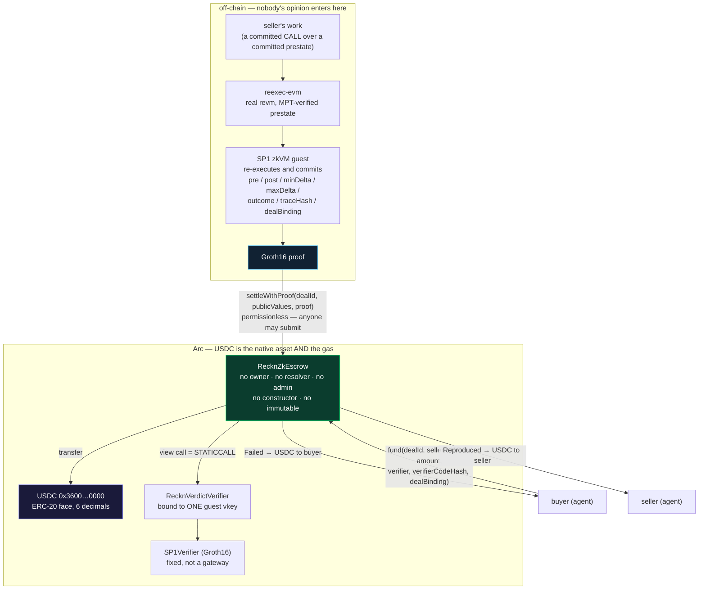

# Reckn on Arc — a conditional USDC payment whose condition is a proof

*Submission aid for ETHOnline 2026, Continuity Track. Written 2026-09-06. Every number
here is measured on this tree; every claim about Arc is transcribed from Circle's docs
with the date it was read.*

---

## The one sentence

**On Arc, Reckn turns an escrowed USDC payment into a conditional payment whose
condition is a zero-knowledge proof that the disputed work re-executes to the verdict
the deal was funded against — with no owner, no resolver, no bridge and no light
client anywhere on the path that decides who gets the money.**

## Why Arc is load-bearing, and not a deployment target

A payment rail is usually interchangeable, and saying "we also deploy here" is not an
integration. Three properties of Arc are doing actual work here:

**1. USDC is the unit of account, not a token you happen to hold.** Arc's native gas
token *is* USDC, and Circle exposes an ERC-20 interface over that same balance at
`0x3600000000000000000000000000000000000000` — 6 decimals on the ERC-20 face, 18 as
native (Arc docs, *Contract addresses*, read 2026-09-06). So an escrow on Arc holds
the chain's own money. The buyer funds in USDC, the gas is USDC, the payout is USDC,
and there is no bridging step in which a different asset stands in for the payment.
For a dispute system this matters more than it sounds: the thing under dispute and the
thing being escrowed are denominated the same way, so "did the seller deliver the
value they promised" and "how much do we release" are the same arithmetic.

**2. It is a stablecoin-native chain, so the escrow's units are the units.** Reckn's
predicate is a **causal delta over a balance**: *did this execution credit at least
`minDelta`?* On a chain where the payment asset is a volatile gas token, a delta
predicate over the payment is a predicate over a moving target. On Arc it is a
predicate over cents. `test_ARC04_six_decimal_amounts_move_exactly` exists because of
this: an escrow tested only against an 18-decimal mock has never been tested against
the units it will actually hold.

**3. Programmable conditionality is the point of the chain, and Reckn's condition is
not a signature.** Arc's brief asks for *"advanced programmable money flows such as
conditional payments … or multi-step settlement."* Almost every conditional payment
in production is conditional on **someone's signature** — a resolver, a multisig, an
oracle committee, an LLM judge. Reckn's is conditional on a **proof**, and the
contract that releases the money has no privileged role at all. `scripts/no-keys.sh`
fails the build if one appears.

**What Arc does *not* change.** Arc is a rail. It does not adjudicate anything, and
nothing in the adjudication path knows it is on Arc. That is the honest form of "one
engine, any rail" — and it is a conclusion, not the pitch.

**The strongest single sentence this repository can say, and it is a test.** A USDC
payment escrowed on Arc, released by a proof about work performed **on Solana** —
`test_ARC07_usdc_on_arc_settled_by_a_proof_about_work_on_solana`. The deal names the
Solana guest's verifier at funding; the escrow calls it, checks that the proof carries
that deal's binding, and pays. **No bridge, no light client, no resolver**, and the
escrow never learns which virtual machine the work happened on. That is what "the
adjudicator is a computation, not a party" buys: a conditional stablecoin payment on
one chain whose condition is a fact about another.

## What had to change in Reckn to settle USDC on Arc

**Nothing in the contract.** `RecknZkEscrow` already takes the payment token per deal:
the buyer names USDC at funding, the same way they name the adjudicating program. No
wrapper, no adapter, no payable path, no new function — which matters because adding
one would have changed the enumerated surface the central claim is built on
(`AGENTS.md` §0).

What was added is the evidence that it is *correct in USDC's semantics*, which a
deployment cannot tell you afterwards:

| file | what it is |
|---|---|
| `zk-verdict/contracts/test/mocks/MockUSDC.sol` | a USDC-shaped token: **6 decimals**, `transfer`/`transferFrom` that return `true` and **revert** rather than returning `false`, and a **blacklist** |
| `zk-verdict/contracts/test/RecknArcUsdcSettlement.t.sol` | six tests over the real committed Groth16 proofs |
| `zk-verdict/contracts/script/DeployArc.s.sol` | the deployment: SP1's Groth16 verifier, the verdict verifier bound to one guest's vkey, the escrow |
| `zk-verdict/contracts/arc.json` | Arc's constants, transcribed with their source and date |
| `scripts/arc-usdc-e2e.sh` | one command: local chain at Arc's chain id → deploy → fund → settle → refund |

## The architecture



Two edges carry the whole design:

- the edge into `RecknVerdictVerifier` is a **`view` call**, so it compiles to
  `STATICCALL`: the escrow calls funder-named code *before* it has checked the binding,
  and that is safe only because the callee **cannot write state**;
- the edge from the proof into `settleWithProof` has **no signer on it**. That is the
  product. Everything else is plumbing.

## What the tests establish

Run: `cd zk-verdict/contracts && forge test --match-contract RecknArcUsdc`

| test | what it pins |
|---|---|
| `test_ARC01_usdc_deal_settles_to_the_seller_on_a_real_proof` | 250.00 USDC released by a **real Groth16 proof**, submitted by an address that is neither buyer nor seller |
| `test_ARC02_usdc_deal_refunds_the_buyer_on_a_proven_failure` | the proof of a **decrease** refunds the buyer — the cell that paid the seller before task 008 |
| `test_ARC03_a_proof_of_another_execution_cannot_take_the_usdc` | a proof of a different execution reverts on `dealBinding`; the USDC stays |
| `test_ARC04_six_decimal_amounts_move_exactly` | 1.234567 USDC moves as 1.234567 |
| `test_ARC05_a_blacklisted_seller_makes_settlement_revert_and_the_money_stays` | USDC can freeze an address; the honest consequence is shown, not described |
| `test_ARC06_no_usdc_is_created_or_destroyed_by_a_settlement` | conservation across funding and settlement |
| **`test_ARC07_usdc_on_arc_settled_by_a_proof_about_work_on_solana`** | **USDC escrowed on Arc, released by a real Groth16 proof about work performed on Solana** — the deal names the Solana guest's verifier, and the EVM proof cannot take that deal's USDC |

## Demo, in four minutes

**The one a judge should drive themselves.** A page whose buttons are transactions —
fund, settle, try to steal it, settle with a Solana proof, and wait out the deadline:

```bash
bash scripts/arc-demo.sh          # local chain + deploy + USDC + a server on :8787
open http://127.0.0.1:8787
```

Nothing on that page is simulated. Each button posts to a small local backend that
shells out to `cast`; the balances shown were read back from the chain, and a failed
theft shows the contract's own error — `BindingMismatch()` — because on this contract
the error name **is** the result. Five things it lets a judge do:

| on the page | what it proves |
|---|---|
| fund 250.00, then settle with the proof | a conditional USDC payment, released by a Groth16 proof and by nothing else |
| **submit another execution's proof** | it verifies — it is a real proof — and `BindingMismatch()` stops it. The money does not move |
| settle with the failing proof | the proof of a **decrease** refunds the buyer |
| **settle with the Solana proof** | **USDC on Arc released by a proof about work on Solana** |
| refund early, then wait 30 days, then refund | `TooEarly()`, then anyone may return the money to the buyer |

```bash
# the same path without a browser (no key, no funds, no account)
bash scripts/arc-usdc-e2e.sh

# 2. the same settlement as tests, including the failure directions
cd zk-verdict/contracts && forge test --match-contract RecknArcUsdc -vv

# 3. the claim this is all built on, enforced rather than promised
bash scripts/no-keys.sh          # exit 0 = no key can move a funded escrow
```

`arc-usdc-e2e.sh` prints its tier before it prints anything else: it is a **local
anvil configured to look like Arc** (chain id 5042002, the same 6-decimal USDC face),
**not** an Arc testnet result.

## Deployment status, stated exactly

**Testnet: deployed, and it has moved money** (2026-09-06, chain 5042002).

| | |
|---|---|
| `RecknZkEscrow` | `0x580f2c3268b0a13bf46c6d381bf807cbf1595669` |
| `RecknVerdictVerifier` | `0xc5f45b9dec0f0b00a1493c63c0204c8c920197b7` (codehash `0x17ab71be…`) |
| `SP1Verifier` | `0xc84a89a576f4c735191f4db484a5d5602c175fbb` |
| USDC | `0x3600000000000000000000000000000000000000` — Circle's predeploy, unmodified |
| deploy cost | 0.0925 USDC of gas, from a faucet address that started with 20.00 |

Two settlements, both with the committed **real Groth16 proofs**:

- **`Reproduced` → seller.** `0x2836ddb83141f3094b4ff055c154fba41d13c74dbe35f21e41a3001e6ef055e0`
  — block 60,720,091, 345,874 gas. The seller's USDC balance went 0 → **1.000000**.
- **`Failed` → buyer.** `0xeb971aa45cce8c04e9a231d67d2737a28c4b637cbef74d46d1a465f01b59456f`
  — the proof of a **decrease** refunded the buyer; the seller's balance did not move.
- **A SOLANA proof released USDC on Arc.**
  `0x5c09cc0772fcfe23acbc9ea5752bd2380bceef1076ce7fc188fc5b2fdc02c4be` — block
  60,721,364, 320,600 gas. The deal named the Solana guest's verifier
  (`0x13d42c0acFa90a57E9A729F0b8d9494B18272366`) and committed the binding that guest
  produces; 1.000000 USDC moved to the seller. **This is the sentence the repository
  exists to make true, and it is now a transaction on a public chain.** It remains a
  statement about the **adjudication path**: the provenance of the committed
  `bank_hash` is not established by it.

**Mainnet:** Circle has **not published Arc mainnet addresses** as of 2026-09-06 (Arc
docs, *Contract addresses*: "Mainnet addresses are not yet available"), so
*deployment-ready* is the only posture available there — the same script, unchanged.

### What the real chain taught us that the mock could not

**USDC on Arc blacklists known-compromised keys, and our first settlement hit it.**
The first deal named anvil's development account #1 as the seller — a publicly known
key. `settleWithProof` reverted with the string `Blocked address`, and
`isBlacklisted(0x7099…)` returns `true` on chain. That is precisely the failure
`test_ARC05` models, reproduced against **Circle's real blacklist** rather than
against our mock: the payout reverts, the deal stays `Funded`, and the money stays in
the contract.

It is still there. Deal `0xa3a6718735b41de2ee08e4d7e2cfa81b1c1b6957f1a374ccaf305e21cc7d8af3`
holds **1.000000 USDC** and can never settle, because the seller is fixed at funding.
`refundAfterDeadline` returns it to the buyer thirty days after 2026-09-06 — which is
the whole reason task 001 exists, and the reason that deal is stuck rather than lost.
Time cannot be warped on a public chain, so **that refund is scheduled, not
demonstrated**; the local demo is where you can watch it happen.

**A deployment we did not need.** A second `RecknVerdictVerifier`
(`0x0aD3f26597C8e2224113E77faC12d8a8F55E5582`) was deployed for the false-release
fixture before checking that both EVM fixtures come from the same guest and therefore
carry the same vkey. It was unnecessary. Recorded here rather than quietly dropped.

## Limits — read these before believing anything above

- **Local tier.** Everything measured here ran under `forge` and `anvil` on one
  machine. No chain of any kind has been contacted. A green suite says nothing about
  Arc testnet, and Arc testnet would say nothing about mainnet.
- **`MockUSDC` is not USDC.** It models the three properties that can change a
  settlement outcome — 6 decimals, revert-not-false, blacklist. It is not upgradeable,
  has no EIP-3009 and no fee logic. The first thing an Arc testnet deployment would
  test is whether that model was right.
- **The timeout is thirty days, and it is the one payout no proof authorises.**
  `test_ARC05` shows a frozen recipient making the payout revert; `refundAfterDeadline`
  is what stops that from being permanent. Anyone may call it after thirty days, it
  pays the caller nothing, and it cannot be called early, twice, or after a proof
  settled the deal. Thirty days is long for a payments product — it is sized so an
  honest seller can produce a Groth16 proof through a prover outage — and a shorter,
  per-deal deadline is the natural next step. It is deliberately **not** configurable
  today: a deadline someone picks is a parameter someone controls.
- **The buyer names the adjudicator.** A buyer who names a program that always returns
  `Failed` makes the seller work for nothing, and on-chain that is indistinguishable
  from an honest `Failed`. The seller's protection is to read the deal's `verifier`
  and `verifierCodeHash` before working; nothing checks it for them.
- **Anchoring is not adjudication.** "No bridge, no light client" describes the path
  that decides the payout. It is not a claim that the committed prestate was the
  chain's real state; on EVM that binding still lives in an off-chain layer.
