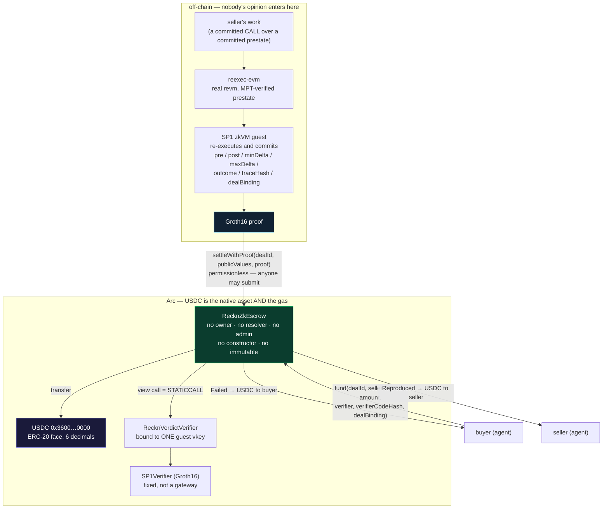

# Status

*Moved out of `README.md` on 2026-09-08. It is reference, not argument.*

The whole dispute → verdict → settlement → **re-verification** slice exists, runs
live on a real node, and is tested — on **both** VMs, behind **one** router: a
funded escrow, a deterministic re-execution backend that binds its prestate to a
committed state root, the canonical verdict record, the settlement signature the
contract provably accepts, a keyless third-party re-verifier that reproduces the
on-chain verdict from public inputs, ERC-8004 reputation evidence, and a money-shot
dashboard on real engine output. The cross-VM binder now re-executes an EVM and a
Solana dispute through a single `BackendRouter`, each returning the same verdict
type. What remains is judge-legibility integrations (Arc / x402 / MCP), a
challenge/bond layer, the cross-chain settlement around routing, and production
content publication.

- **Protocol:** locked — [`docs/protocol-architecture.md`](docs/protocol-architecture.md)
  (VM-neutral verdict envelope, committed spec/delivery/anchor codecs, EVM V1
  profile, data-availability + timeout policy, and the reproducibility vs
  settlement-authority split).
- **Settlement contract (EVM V1):** implemented in [`contracts/`](contracts) —
  escrow state machine, EIP-712 resolver verdicts, resolver/backend allow-list,
  timeout escape hatches, nonzero-window guards, a cross-language digest pin
  against the keeper, an ERC-8004-style `ReputationEvidence` projection (below),
  and end-to-end tests that settle on the **real engine output** (the
  `moneyshot.json` hashes) and assert `VerdictCommitted` carries the actual
  `traceHash`. Plus an **optimistic settlement** path (`resolveOptimistic` →
  challenge window → `finalizeSettlement`): the resolver must be **bonded** in the
  registry, settlement is deferred so the reproducible verdict can be checked
  before funds move, and a second registered resolver's **conflicting** verdict
  during the window fail-safes to a buyer refund and emits `Fault`. Slashing the
  liar is **automatic**: `slashWithQuorum` lets anyone present a **K-of-N
  registered-resolver quorum** co-signing the true (conflicting) verdict — since
  the verdict is deterministic, K honest resolvers sign the same one — and slashes
  the faulty resolver's bond to the submitter as a bounty, no governance. This
  turns the keyless-*detectable* verdict into an economically-*enforced* one,
  reducing trust from a single resolver to an honest-majority quorum. Full
  zero-trust single-signer adjudication still wants a fraud-proof VM or a ZK proof
  of the re-execution. Plus an **opt-in seller data-availability bond**: the buyer
  commits a `requiredSellerBond` at funding (bound into the signed nonce, so a
  relayer can't weaken it), the seller locks it at `deliver()`, and it is forfeited
  to the buyer **only** on a dispute timeout (evidence withheld) — every other exit,
  including a `Failed` verdict on the merits, returns it. So the bond punishes
  *withholding*, not *losing*, and a throwaway seller can no longer dodge the cost
  of withholding with just a reputation mark. `forge test`: **57 passing**.
- **Reputation (ERC-8004 style):** on every verdict the escrow emits
  `ReputationEvidence(agent, reproduced, dealId, traceHash, backendId)` — a pure
  projection that never changes settlement. Unlike AgentRankr's self-reported,
  sybil-gameable feedback, the seller-agent's reputation is **earned by a
  reproducible verdict**: anyone can re-derive `traceHash`. A dispute that times
  out with no verdict *also* emits a negative signal (`reproduced = false`, **zero
  trace**), so a seller cannot dodge the mark by withholding delivery/replay
  evidence to force a timeout; the zero trace distinguishes it from a reproduced
  `Failed`. Emitted on-chain and asserted by contract tests.
- **Re-execution backend (EVM V1):** revm 38 replay implemented in
  [`reexec-evm/`](reexec-evm) — deterministic CALL replay with four predicate
  kinds: `RESULT_EQUALS`, `POSTSTATE_EQUALS`, `POSTSTATE_BOUNDED`, and
  `POSTSTATE_DELTA`. `POSTSTATE_BOUNDED` widens adjudication to a **funded
  envelope** over an inclusive `[min, max]` range (`≥ minOut`, `≤ cap`, or
  equality), a *property* of the post-state. `POSTSTATE_DELTA` closes the
  soundness gap that a property leaves open — it adjudicates `post − pre`
  (saturating), the increase the plan itself **caused**, so a no-op plan cannot
  satisfy `≥ minOut` off the prestate. That makes the flagship "this swap
  credited ≥ minOut" claim sound at the engine level rather than resting on the
  buyer's predicate design. Honest delivery → `Reproduced`; a seller's false
  success claim → `Failed` (→ refund). Offline MPT account/storage proofs bind
  the closed replay witness to `anchor.state_root`; proof failure or a missing
  witness is an operational error, not a verdict. And `state_root` itself is now
  bindable to the real block: when the anchor carries the block header,
  [`header.rs`](reexec-evm/src/header.rs) proves
  `keccak256(rlp(header)) == block_hash` and the header's `state_root` +
  environment equal the anchor's — so a forged `state_root` is impossible without
  breaking the consensus `block_hash` (the EVM analogue of the SVM `bank_hash`
  verifier), a mismatch being `OperationalError::HeaderMismatch`. This is
  **enforced in the keyless verdict path** (the keeper commits the block header;
  `recompute_verdict` verifies it) and exercised end-to-end against a real anvil
  block header in [`anvil-e2e.sh`](#try-it-one-command). Replay ignores
  tx-validity ceremony (base-fee / nonce) so honest deliveries reproduce against
  real blocks; balance for `value` is still enforced. `cargo test`: **16 passing**
  (incl. adversarial: a no-op plan cannot forge a `POSTSTATE_DELTA` credit, and a
  `state_root` cannot be forged without breaking `block_hash`).
- **Re-execution backend (Solana / SVM):** [`reexec-svm/`](reexec-svm) — the same
  mechanism on Solana via `LiteSVM`, replaying a committed **signed** transaction
  against a committed account snapshot and emitting the **identical VM-neutral
  `ReplayRecordV1`** as the EVM backend. That shared record — one Rust codec in
  [`packages/protocol-rs`](packages/protocol-rs), asserted against the same golden
  as the TS/Solidity vectors — proves the VM-neutral waist across a second VM and
  is the foundation the cross-VM binder will stand on. The **replay boundary is
  settlement-grade (V2)**: signatures verified (a forged signer → `Failed`), the
  snapshot commitment covers accounts + `rent_epoch` + Program/ProgramData +
  runtime profile, ELF derived from ProgramData not the seller, and a closed-world
  account-load trap (a small vendored LiteSVM fork) makes any unwitnessed read an
  operational error, never a phantom-default `Reproduced`. Snapshot
  **authenticity** now has a real verifier: [`reexec-svm/src/bankhash.rs`](reexec-svm/src/bankhash.rs)
  recomputes the SIMD-0215 accounts lattice hash over the account set and
  re-derives `bank_hash` (via the audited `solana-lattice-hash` crate), so with
  `snapshot_is_complete` set, a snapshot that does not reproduce the committed
  `bank_hash` is an `OperationalError::BankHashMismatch` rather than a decorative
  field. Because Solana (unlike EVM's MPT) has **no compact per-account inclusion
  proof**, the compact per-tx prestate binds *transitively*:
  [`reexec-svm/src/authenticity.rs`](reexec-svm/src/authenticity.rs)'s
  `verify_prestate_authenticity` checks the full snapshot is the committed archive,
  reproduces `bank_hash`, and that every compact account is a faithful subset of
  it — no per-account proof needed. This is **enforced in the dispute path**: the
  keeper's `load_for_disputed_deal` rejects an unauthentic prestate
  (`KeeperError::SnapshotAuthenticity`) before any replay, for both the resolver
  and the keyless verifier. The remaining piece is *ingesting* a real Agave archive
  into that full snapshot. See
  [`docs/svm-snapshot-authenticity.md`](docs/svm-snapshot-authenticity.md). The
  closed runtime still permits only the System builtin (custom SBF is
  `UnsupportedEnvironmentDependency`). The predicate set is
  symmetric with the EVM backend: `RESULT_EQUALS`, `LamportsEquals`, the bound
  `LamportsBounded` (`≥ minOut` via `max = u64::MAX`), and the causal
  `LamportsDelta` (`post − pre` credited increase) — so both the funded envelope
  and the sound "this fill credited ≥ minOut" claim adjudicate identically across
  the two VMs. `cargo test`: **30 passing** (reckn-record: 1; incl. the
  no-op-cannot-forge-a-delta adversarial regression, the `bank_hash`
  lattice-hash authenticity verifier, and the compact-prestate archive binding).
- **Settlement contract (Solana / SVM):** [`escrow-svm/`](escrow-svm) — a Pinocchio
  program mirroring the EVM escrow: the same four-state machine, a Token-2022 vault,
  and a `resolve` that verifies the resolver's verdict by strict introspection of a
  preceding native **Ed25519** instruction over a domain-separated
  `genesis‖program_id‖deal_id‖VerdictCommitment` message. An operational outcome can
  never settle — only `timeout_refund` favors the buyer — and `ReputationEvidence`
  is logged (a dispute that times out emits a seller-attributed **evidence-withheld**
  signal — `FAILED` outcome with a zero trace and zero resolver — mirroring the EVM
  escrow, so withholding replay material cannot dodge the negative mark). It also
  mirrors the EVM **optimistic settlement** faithfully: a per-resolver registry
  (PDA allow-list, the Solana analogue of `ResolverRegistry`), lamport **bonds**,
  `resolve_optimistic` (bonded, opens a challenge window in a new `SETTLING` state),
  `finalize_settlement` (permissionless, after the window), and — since Solana can
  verify a *second* resolver's Ed25519 verdict by introspection — a true
  **peer-conflict** `challenge_verdict` that fail-safes to a buyer refund + `Fault`,
  plus admin `slash`. LiteSVM tx-level e2e (instant release / refund / forged
  signature / swapped anchor / operational outcome / timeout evidence-withheld /
  double-resolve / conservation, **plus** optimistic finalize, unbonded/unregistered
  rejects, peer-conflict refund, bond deposit/slash): **10 passing** via
  `cargo build-sbf`.
- **Keeper (Solana):** [`reckn-svm-keeper/`](reckn-svm-keeper) — the SVM analog of
  the EVM keeper: SHA-256-check the content store, match it to the on-chain deal,
  replay via `reexec-svm` (an operational error is never signed), build the
  escrow's `VerdictCommitment`, and emit the exact `[ed25519(current-ix), resolve]`
  adjacency the program's introspection requires — using the escrow's own
  `verdict_message` + the canonical Ed25519 helper, i.e. byte-identical to the
  shape `escrow-svm`'s passing e2e already accepts. A keyless `verify` re-derives
  the on-chain verdict from public inputs. Settlement is **optimistic by default**
  (matching the EVM keeper): the keeper registers + bonds the resolver, submits
  `resolve_optimistic` (opening a challenge window), and `finalize_settlement`
  settles once it elapses. Proven end-to-end by a LiteSVM full-loop test: content
  SHA-256 → fund → deliver → challenge → replay → register + bond → the keeper's
  `[ed25519, resolve_optimistic]` accepted → window elapses → finalize → honest
  releases the seller / false claim refunds the buyer → keyless `verify` agrees.
- **Cross-VM binder (one router, both VMs):** [`binder/`](binder) — a `ReexecBackend`
  trait both VMs implement, an `EvmBackend` + `SvmBackend` adapter pair, and a
  `BackendRouter` that verifies the committed content hashes and routes a dispute to
  the backend named by its committed `backend_id` (fails closed on unknown/ambiguous
  — never the wrong VM), returning a `VerdictEnvelopeV1` carrying the shared
  `ReplayRecordV1`. Because the record codec is shared, an EVM verdict and a Solana
  verdict are literally one type. Every extra replay input — the EVM proof-carrying
  witness, the SVM snapshot + runtime profile — is pulled only through a
  content-addressed `BackendArtifactResolver` (SHA-256 re-verified, never live RPC);
  a missing or tampered artifact is an operational `BackendError`, never a verdict.
  **Proven by a single-router integration test** ([`tests/router_two_vms.rs`](binder/tests/router_two_vms.rs)):
  one `BackendRouter` with both adapters registered re-executes four disputes through
  one `route()` — EVM honest → `Reproduced`, EVM false → `Failed`, SVM honest →
  `Reproduced`, SVM false → `Failed`, all the same `VerdictEnvelopeV1` — while a
  mismatched `backend_id` is `UnknownBackend` and a missing/tampered artifact fails
  closed. Its EVM fixtures use the exact valid-MPT-witness builder from `reexec-evm`
  (exposed via a cfg-gated `testkit` feature so the production crate is unchanged and
  the test cannot drift onto a weaker witness). `cargo test`: **6 passing**. The
  cross-chain settlement *around* routing (finality on both chains, verdict
  propagation, double-settle rules) is the remaining frame-thick step — with a
  **self-verifying ZK verdict** as the trust-minimized verdict transport (A verifies
  the proof itself, no light client for the authority) —
  [`docs/cross-chain-settlement.md`](docs/cross-chain-settlement.md).
- **Money-shot dashboard:** [`dashboard/`](dashboard) — a self-contained,
  animated money-shot driven by real `reexec-evm` output: the escrow pot moves, a
  live `reckn-keeper` console + ledger stream the resolve, and the outcome lands on
  an on-chain `resolve()` receipt. Same dispute — the opinion judge releases escrow
  to a false claim; Reckn replays the actual plan and refunds the buyer. Open it
  locally — the data is inline, so `file://` works with no server and no setup.
- **Keeper (chain shell + settlement signature):** [`keeper/`](keeper) — maps a reproducible
  replay to the `VerdictCommitment` and EIP-712-signs it. The digest is
  cross-checked against the contract in both Rust and Foundry (a shared golden),
  so a keeper signature is provably accepted by `resolve()`. It decodes all EVM
  content through the shared [`reckn-evm-content`](reckn-evm-content) codec (no
  drift with the binder adapter). The **witness is committed, not RPC-built at
  dispute time**: the seller publishes a proof-carrying witness with
  `reckn-keeper witness … --write <store>` and the delivery commits its SHA-256
  (`witnessContentHash`); `once` / `verify` then resolve that committed witness by
  hash and MPT-verify it against `anchor.state_root` before replay — they never
  replay a live RPC witness. Its HTTP shell polls `Disputed`, SHA-256-checks
  content-store bytes before parsing, replays, and submits **`resolveOptimistic`**
  (a bonded verdict that opens a challenge window). The included anvil E2E drives
  the full optimistic path — commit verdict → window elapses → `finalizeSettlement`
  → false claim `Failed` → refund / honest credit `Reproduced` → release — each
  keylessly re-verified. `cargo test` + `forge test`: **keeper 3, contracts 57**.
- **Independent re-verification (the trust property, executable):**
  `reckn-keeper verify <rpc> <escrow> <content-store> <dealId>` — a **keyless**
  third party reads the resolver's on-chain `VerdictCommitted` and re-derives the
  verdict from public inputs alone (content store + re-execution), then asserts
  outcome / resultHash / prestateRoot / traceHash all match. This is what a TEE'd
  LLM verdict cannot offer: **don't trust the resolver — reproduce its verdict
  yourself.** The anvil E2E runs it as a final step and fails on any mismatch.
- **Economic security (optimistic settlement + quorum slashing):**
  `resolveOptimistic` bonds the resolver and opens a challenge window before funds
  move; a conflicting verdict fail-safes to a buyer refund. Slashing the liar is
  **automatic**: `slashWithQuorum` accepts a **K-of-N** registered-resolver quorum
  co-signing the true verdict — provably contradicting the faulty one — and slashes
  its bond, no governance. This reduces trust from a single resolver to an
  honest-majority quorum; zero-trust single-signer adjudication still wants a
  fraud-proof VM or a ZK proof of the re-execution. Optimistic settlement is the
  **default on both VMs** — the keeper submits `resolveOptimistic` and drives commit
  → window → `finalize`.
  Optimistic settlement is now the default on **both** VMs — the EVM keeper submits
  `resolveOptimistic` and the SVM keeper submits `resolve_optimistic` (registry +
  bond + window + peer-conflict + finalize + slash), each driven end-to-end.
- **Toward zero-trust (ZK, PoC):** [`zk-verdict/`](zk-verdict) proves reckn's
  causal delta verdict inside an **SP1 zkVM** and verifies the proof — the verdict
  *derivation* needs no trusted resolver, run end-to-end on CPU. The verdict is also
  **verifiable on-chain**: [`RecknVerdictVerifier.sol`](zk-verdict/contracts/src/RecknVerdictVerifier.sol)
  checks an SP1 proof against the program vkey and exposes the verdict, authoritative
  *because the proof verifies* — a chain-agnostic check, which is what makes a ZK
  verdict the **trustless cross-chain settlement primitive** (any paying chain
  verifies a verdict itself, no bridge or light client for the authority). Verified
  with a **real Groth16 proof** against SP1's canonical `SP1Verifier` (circuit
  v6.1.0) on-chain (`forge test`, mock + real-verifier suites green).
- **Full re-execution in the zkVM (trusted-prestate AND trusted-`post` gaps, closed):**
  a second guest ([`zk-verdict/program-revm`](zk-verdict/program-revm/src/main.rs))
  **verifies the committed prestate is authentic** (each account MPT-proven against
  the committed `state_root`, each slot against the account storage root — via
  `alloy-trie` in-guest, the same check `reexec-evm` does off-chain) and then runs
  **real `revm` inside the SP1 zkVM** to **execute the seller's CALL under proof** and
  derive the post-state. So the prestate is *proven authentic* and `post` is *computed
  by the EVM* — both in the proof, not trusted from a resolver; the trace hash binds
  the `state_root`. Verified: revm 38 + alloy-trie compile to the zkVM target; the
  SSTORE plan (slot 7 = 42 proven) executes to `post=142` → `Reproduced` (406,715
  cycles), a no-op → `Failed`, and a **tampered prestate value is rejected** (the
  guest panics on the bad MPT proof — no verdict for an inauthentic state). A **real
  Groth16 proof verifies on-chain** through the same generic verifier
  (`RecknReexecVerdict.t.sol`). Remaining on the EVM side: the disabled
  `c-kzg`/`ecrecover` precompiles and scale (a full block).
- **SVM re-execution in the zkVM (the Solana mirror):** a third guest
  ([`zk-verdict/program-svm`](zk-verdict/program-svm/src/main.rs)) closes both
  authenticity gaps like the EVM guest: it **recomputes the block `bank_hash`** from
  the committed accounts (SIMD-0215 lattice hash, `solana-lattice-hash` in-guest) and
  requires it to match the committed one, **signature-verifies the real committed
  Solana transaction** (`Transaction::verify`, real ed25519), and **re-executes its
  System transfer** against the authenticated prestate to derive the post-lamports,
  then applies the `LamportsDelta`. So the prestate is *proven authentic* and `post`
  is *computed by re-execution*, not trusted. Verified: `System::Transfer(2_000_000)`
  → `bank_hash`-bound recipient `post` executed to `2_000_001` → `Reproduced`
  (986,097 cycles); below-floor → `Failed`; a **tampered signature is rejected** (verify fails
  → `Failed`) and a **tampered account is rejected** (fails the in-guest `bank_hash`
  check → guest panics). The `bank_hash` recompute is byte-identical to
  `reexec-svm::bankhash`. Its **real Groth16 proof verifies on-chain through the same
  generic verifier** (`RecknSvmVerdict.t.sol`) — one verdict contract, EVM and SVM
  proofs alike. Honest scope: reckn's SVM permits **System builtins only**, so this is
  not the full Agave/LiteSVM runtime (out of scope in-zk) nor custom SBF (reckn runs
  none); the `bank_hash` check is conclusive over a *complete* account set (the demo
  treats its set as the world, as reckn's tests do).
- **ZK settlement — the proof moves money:**
  [`RecknZkEscrow`](zk-verdict/contracts/src/RecknZkEscrow.sol) settles escrow **purely
  on a ZK-verified verdict, no resolver**: `settleWithProof` verifies the SP1 proof via
  `RecknVerdictVerifier` and, only if the proof's `dealBinding` (a commitment each guest
  makes over its authenticated prestate + predicate + plan, matched to the deal at
  funding) is correct, releases to the seller (`Reproduced`) or refunds the buyer
  (`Failed`). Tested end-to-end with a **real Groth16 proof of the EVM re-execution
  settling to the seller**; binding mismatch and unverified proof revert. The whole
  path — re-execute in-guest → prove → verify on-chain → settle — runs in one command:
  [`bash zk-verdict/scripts/zk-e2e.sh`](zk-verdict/scripts/zk-e2e.sh). `forge test`: **12
  passing**. Integrating `settleWithProof` into the main `RecknEscrow` lifecycle is the
  follow-up.
- **Next:** the EVM quorum-slashing mirror on the SVM escrow (Ed25519 quorum
  introspection + lamport bond slash); extending the re-execution guest's
  opcode/precompile coverage and scale; and cross-chain
  settlement around the binder (finality on both chains + verdict propagation +
  double-settle
  rules).

### Arc — a conditional USDC payment whose condition is a proof

**The architecture** (both Arc prizes ask for one; this is the only copy — `docs/arc-usdc.md`
points here rather than keeping a second that could drift):



Two edges carry the whole design: the escrow reaches its verifier through a **`view`
call**, so the funder-chosen adjudicator runs under `STATICCALL` and cannot write state;
and `settleWithProof` takes **no adjudicator parameter**, because the deal named it at
funding.


On [Arc](https://docs.arc.io), USDC is the native gas token and Circle exposes an
ERC-20 interface over that same balance at `0x3600…0000` (6 decimals on that face).
Reckn's escrow already names its payment token per deal, so **settling USDC on Arc
required no change to the contract at all** — what it required was evidence that the
settlement is correct in USDC's units and under USDC's semantics.

```bash
bash scripts/arc-demo.sh         # local chain + deploy + USDC + a server; then open :8787
                                 #   and DRIVE it: fund, settle, try to steal it, wait out
                                 #   the deadline. Every button is a real transaction.
bash scripts/arc-usdc-e2e.sh     # the same path without a browser
cd zk-verdict/contracts && forge test --match-contract RecknArcUsdc   # 7 tests, real Groth16 proofs
```

250.00 USDC released by a proof, a proof of a **decrease** refunding the buyer, and —
the sentence this repository exists to make true — **USDC escrowed on Arc released by
a proof about work performed on Solana**, with no bridge, no light client and no
signature anywhere on the path that decides who is paid. Why Arc is load-bearing rather than a deployment target, the architecture
diagram, and the limits are in [`docs/arc-usdc.md`](docs/arc-usdc.md).

**That paragraph used to end "nothing is deployed to Arc yet."** It is deployed now:
the escrow lives at
[`0x580f2c32…`](https://testnet.arcscan.app/address/0x580f2c3268b0a13bf46c6d381bf807cbf1595669)
on Arc testnet and four settlements moved real testnet USDC, two of them decided by
proofs about work performed on Solana. The receipts are in the table above, and
`zk-verdict/scripts/arc-receipts.sh` exists because two of the four were transcribed
into this repository **wrong** the first time — right length, right prefix, linking to
nothing. Mainnet remains out of reach for a reason that is not ours: Circle had not
published Arc mainnet addresses as of 2026-09-06, so "deployment-ready" is the ceiling
and the missing address list is a precondition, not a task.

### Closed during ETHOnline (2026-09-04 onward)

Two of the gaps this section used to list were **soundness bugs**, not limits, and
they are closed. They are kept here rather than deleted, because a reader who saw
the earlier text deserves to know what happened to it.

- **The verdict is taken over the whole 256-bit value domain** (the limb-0 defect
  found 2026-09-04 is closed, task 008). The guest used to take the delta on limb 0
  while the off-chain engine took it on the full `U256`, so `pre = 2^64` /
  `post = 2^64 − 1` — a *decrease* — proved as the largest possible credit and
  released to the seller. Verdict values are `uint256` on both sides now, and
  fourteen vectors (`zk-verdict/script/tests/value_domain.rs`) decide each case
  twice — replayed off-chain and executed in-guest — and require the two to agree.
- **Engine identity is checked, not assumed.** The guest used to configure only
  `chain_id`, so it ran at revm's default spec with a zeroed block env while
  `reexec-evm` pinned the hardfork and the full environment. Thirteen vectors
  (`zk-verdict/script/tests/engine_identity.rs`) now hold each field to that
  agreement — PUSH0 across the Merge/Shanghai boundary, `TIMESTAMP`, `NUMBER`,
  `COINBASE`, `PREVRANDAO`, `GASLIMIT`, `CHAINID`, `BASEFEE`, `ORIGIN`, `GASPRICE`
  — and eighteen more require every one of them to move `dealBinding`
  (`zk-verdict/script/tests/binding.rs`), so a proof cannot be carried from one
  environment to another.

- **The build condition read one file, and settlement authority left it** (found
  2026-09-04, closed by task 008). `scripts/no-keys.sh` checked `RecknZkEscrow.sol`
  only, while `settleWithProof` obeys the struct `RecknVerdictVerifier` returns — a
  different file in the same deployment, on the same authority path. A constant-keyed
  branch there is a resolver and it passed every check we had. Check 5 now closes that
  file by six properties rather than by a list of forbidden constructs.
- **`fallback()` and `receive()` were invisible to the enumeration** (found
  2026-09-05, closed by task 009). Neither carries the `function` keyword, so the
  state-changing surface check could not see them; a `fallback` that drains any funded
  deal compiled and passed all four checks. Check 2 now closes the entry-point set
  instead of enumerating what its grep finds — and the region it reads reaches the
  whole of the deployed code, because an **inherited** member is declared above the
  contract line and was outside every clause until 009's review found it.

- **A funded deal could lock forever** (closed 2026-09-06). The keyless escrow had
  no timeout: if the prover never showed up — or if a stablecoin froze the recipient,
  which `test_ARC05` demonstrates — the money stayed in the contract with no way out.
  `refundAfterDeadline` returns it to the buyer after thirty days. It is
  **permissionless**, it pays the caller nothing, it cannot be called early or twice
  or after a proof settled the deal, and in either order the money comes out exactly
  once (`RecknTimeout.t.sol`, six tests). The waiting period is a constant of the
  protocol — a deadline someone picks is a parameter someone controls — and
  `refundAfterDeadline` was already in the enumerated surface, so the central claim
  did not widen to make room for it.

The evidence is mechanical, not narrative: `bash zk-verdict/scripts/ac008.sh AC-02`
and `AC-03` run those vectors and assert the count before they assert success, and
`bash scripts/no-keys.sh` names the clause that fires for each of the shapes above.

### Known gaps (not closed)

Stated here so no reader has to discover them by reading the source. None of these
is closed by anything above; the honest scope in
[`zk-verdict/README.md`](zk-verdict/README.md) governs.

- ~~**`RecknZkEscrow` has no timeout.**~~ **Closed 2026-09-06** — see the closed
  list above. A funded deal whose proof never arrives is returned to its buyer after
  thirty days by `refundAfterDeadline`, which anyone may call and which pays the
  caller nothing.
- **In-guest precompiles run on different backends, and parity is unverified.**
  This repository has long said they are *disabled* in-guest. They are not:
  `revm-precompile` falls back to pure-Rust implementations when the native
  features are off — `k256` for `ecrecover` (`secp256k1.rs:1-8`, preference order
  `secp256k1 → k256`) and `arkworks` for KZG (`kzg_point_evaluation.rs:87-101`).
  So a plan touching `0x01` or `0x0a`–`0x11` is not unsupported; it runs against a
  *different implementation* than the off-chain engine, and the two have never been
  checked for equivalence. Corrected 2026-09-04.
- **Cross-VM settlement is not cross-VM anchoring.** One escrow settles an EVM proof
  and a Solana proof (task 009), and that is a statement about the **adjudication
  path**: no bridge, no light client, no resolver decides the payout. It is **not** a
  statement that the committed `bank_hash` was ever a real Solana cluster's — the
  guest recomputes it from the committed account set, and the demo treats that set as
  the world. The EVM side is symmetric: the `state_root` ↔ block-header binding still
  lives in the off-chain `reexec-evm::header` layer. *Settled by a Solana proof* means
  *settled by a proof about a Solana-shaped state the deal named*.
- **The seller now has three values to check, and nothing checks them for them.** After
  009 the buyer names the adjudicating program at funding. A buyer who names a sham has
  defrauded only themselves — but a buyer who names one that always returns `Failed`
  makes the seller work for nothing, and on-chain that is indistinguishable from an
  honest `Failed`. The seller's protection is to read the deal's `verifier`,
  `verifierCodeHash` and `dealBinding` before working.
- **Tier.** Every result in this repository is local: `forge` and `cargo` on one
  machine, in-memory, one process. No chain of any kind has been contacted. A green
  suite says nothing about testnet or mainnet.
- **Scale.** The guest proves one CALL plus one delta check. A full block or an
  arbitrary contract set is more cycles on the same architecture — but that is a
  claim about architecture, not a measured result.
- **`state_root` ↔ block-header binding lives off-chain**, in the
  `reexec-evm::header` layer, not inside the guest.
- **SVM scope.** The Solana guest permits System builtins only — not the full
  Agave/LiteSVM runtime, and no custom SBF.
- **Not yet submitted anywhere.** The repository is private until submission; the
  pre-flight in [`SUBMISSION.md`](SUBMISSION.md) is unchecked on exactly those two
  lines.
