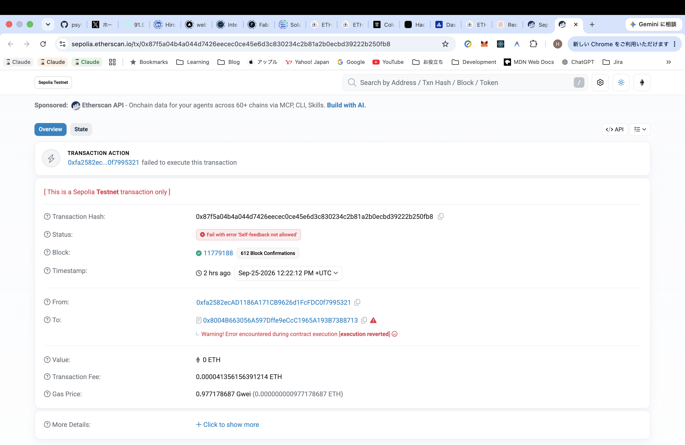
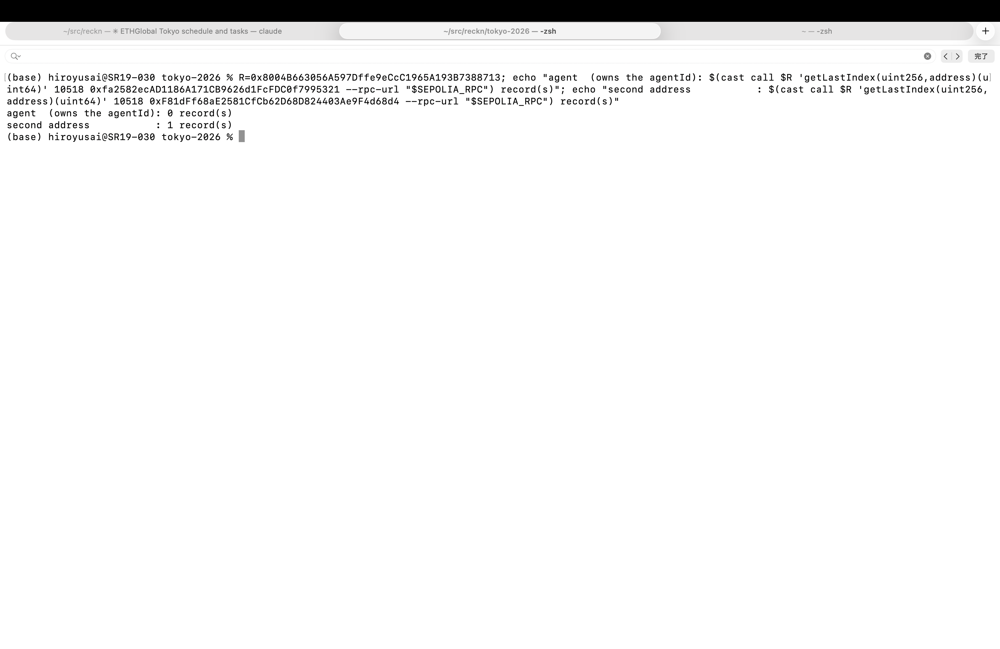
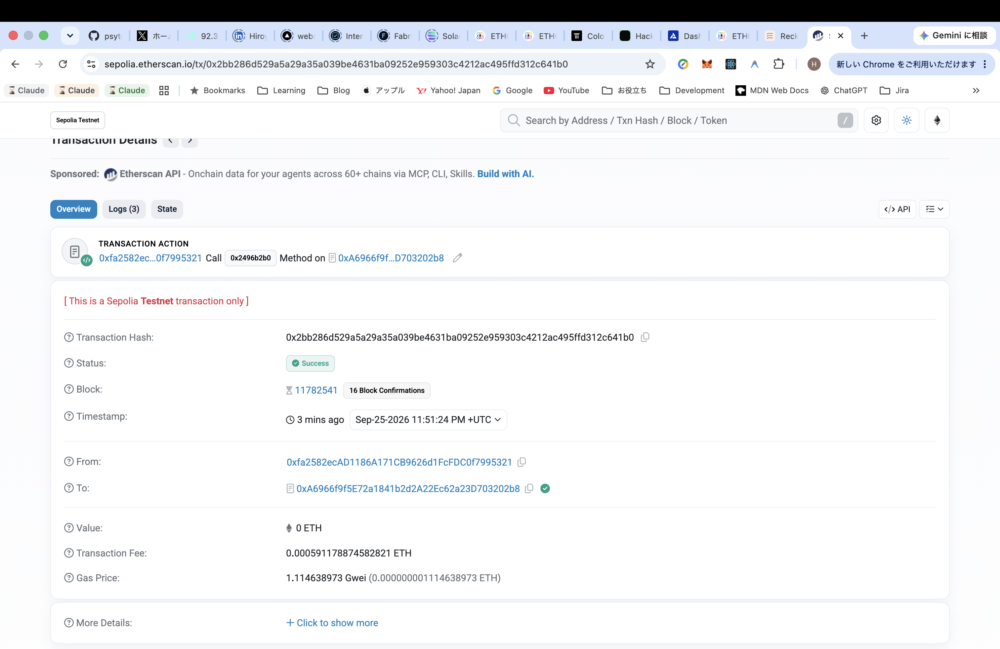
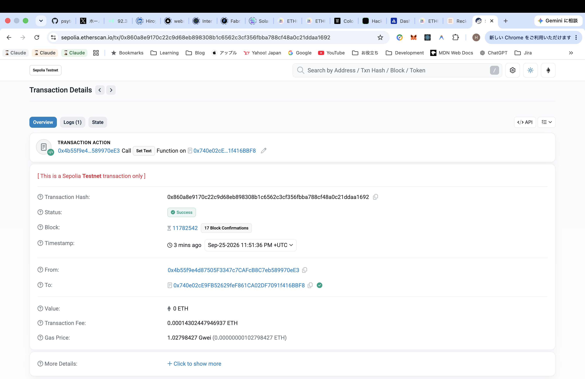
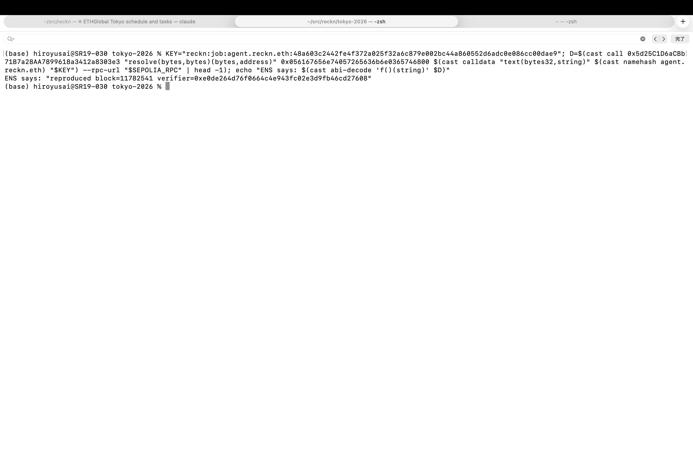

# Sepolia receipts — ETHGlobal Tokyo 2026

**Event work.** Every hash below is recorded in
[`zk-verdict/contracts/sepolia.json`](../../zk-verdict/contracts/sepolia.json), which was
**generated from the chain, not typed**, and `bash zk-verdict/scripts/sepolia-receipts.sh`
closes the loop in both directions: no link here is absent from the record, and no entry in
the record is linked nowhere.

It also checks a third thing, because the first two stay green while the demonstration dies:
**exactly one event transaction failed, it came from the account that owns the agent, and the
identical accepted call came from a different account.** One `approve()` on the agent token
would make the refusal disappear, and this check is what notices.

## Beat 1 — an agent's own address cannot write its record, and a second address can

ERC-8004 registries, deployed by the 8004 team and used unmodified
([`0x8004A818…`](https://sepolia.etherscan.io/address/0x8004A818BFB912233c491871b3d84c89A494BD9e) ·
[`0x8004B663…`](https://sepolia.etherscan.io/address/0x8004B663056A597Dffe9eCcC1965A193B7388713)),
`getVersion()` = **2.0.0** on both. **agentId 10518.**

| | transaction | result | gas | block |
|---|---|---|---|---|
| register the agent | [`0xfb324823…`](https://sepolia.etherscan.io/tx/0xfb32482311af79c9aedffc915c1b5f6b0bec48027216a64926e436c7168b029e) | success | 106,883 | 11,779,151 |
| **the agent writes its own record** | [`0x87f5a04b…`](https://sepolia.etherscan.io/tx/0x87f5a04b4a044d7426eecec0ce45e6d3c830234c2b81a2b0ecbd39222b250fb8) | **failed** | 42,322 | 11,779,188 |
| a second address writes it | [`0xe8a44a1a…`](https://sepolia.etherscan.io/tx/0xe8a44a1a0e81d4e7109a76a2c66def4d17339a444bbce98f840f78d9bfd3f226) | success | 190,352 | 11,779,191 |

The refusal is `Self-feedback not allowed` —
[`ReputationRegistryUpgradeable.sol:108`](https://github.com/erc-8004/erc-8004-contracts).
It was sent with an explicit gas limit so estimation could not swallow it: **a refusal nobody
can click is weaker than one they can.**

### The state, which outlives the transactions

| | |
|---|---|
| `getClients(10518)` | one address: `0xf81dff68…` — the second address |
| `getLastIndex(agent's own address)` | **0** |
| `getLastIndex(second address)` | **1** |
| `readFeedback(…, 1)` | value **100**, tag `quality`, `isRevoked false` |

**The owner wrote nothing. A second address wrote one record.** That is what beat 1 claims,
and it is readable from the chain by anyone.

### What this does not show

The standard **requires** the refusal — [`erc-8004.md:217`](https://eips.ethereum.org/EIPS/eip-8004)
— and the official contracts enforce it. **This is not a hole anyone missed.** The spec says so
itself in Security Considerations: *"Sybil attacks are possible… We expect many players to build
reputation systems."* ERC-8004 defers *who may write* to a layer above it. What the rest of this
submission builds is one answer in that layer: the right to write a record is created by a
settlement.


## The night's deployments

| | address |
|---|---|
| `RecknZkEscrow` | [`0x6d6a9deb67d785BC131a5d732617EABE751098C5`](https://sepolia.etherscan.io/address/0x6d6a9deb67d785BC131a5d732617EABE751098C5) |
| `RecknVerdictVerifier` | [`0xe0dE264D76f0664C4e943fc02e3D9FB46CD27608`](https://sepolia.etherscan.io/address/0xe0dE264D76f0664C4e943fc02e3D9FB46CD27608) |
| our `PermissionedRegistry` | [`0x1Ad360D93ccD6230FB14D213134107BF89a428cf`](https://sepolia.etherscan.io/address/0x1Ad360D93ccD6230FB14D213134107BF89a428cf) |
| our resolver (UUPS proxy) | [`0x740e02cE9FB52629feF861CA02DF7091f416BBF8`](https://sepolia.etherscan.io/address/0x740e02cE9FB52629feF861CA02DF7091f416BBF8) |

| | transaction | result | gas |
|---|---|---|---|
| the escrow, on Sepolia this time | [`0x43c3c7e3…`](https://sepolia.etherscan.io/tx/0x43c3c7e30f3f61c79b3937c1b8cf33e9e332fd737c474d28603817eb667226c6) | success | 1,252,808 |
| the verdict verifier | [`0xefd497fc…`](https://sepolia.etherscan.io/tx/0xefd497fc27f448f239821058ccd6605c0011896ec655d2ff3370fe66cb638536) | success | 476,388 |
| the parent registry | [`0x62191904…`](https://sepolia.etherscan.io/tx/0x6219190438d0b63cce4895ed8c67e02613d07968c9c36eb7be699be215631b24) | success | 5,273,028 |
| the resolver instance | [`0xd7900814…`](https://sepolia.etherscan.io/tx/0xd7900814c322aca1b5eb41ee7c7e9e64ddbd395237c6be4492c8189631f69085) | success | 177,868 |
| allow the registrar to take MockUSDC | [`0x3069906c…`](https://sepolia.etherscan.io/tx/0x3069906c378c5125729bf3773fed2f5c61e58ebe5e89e4f0e288ed5afd43f61b) | success | 46,354 |
| commit `reckn` | [`0xa43ffa3a…`](https://sepolia.etherscan.io/tx/0xa43ffa3aef645c43d1e3ca1f246c7856ff533d1fadc9190e90edc7170a264fe5) | success | 45,438 |
| **register `reckn` on the real ETHRegistrar** | [`0x1a66082b…`](https://sepolia.etherscan.io/tx/0x1a66082b77cffdb95490fc65f6d361eb09b3e3569907299961ac2a20c22a9d5f) | success | 241,718 |
| **issue `agent.reckn.eth`, ROLE_RENEW only** | [`0x5643607d…`](https://sepolia.etherscan.io/tx/0x5643607ddf2e06e9b8d609f49316d893784e43bfbe9d2c9ac558e972fba2a6f3) | success | 143,627 |

### Three choices worth stating

**The verifier points at SP1's immutable contract, not at the gateway.**
[`0xb69f2584…`](https://sepolia.etherscan.io/address/0xb69f2584CBcFf99a58C4e7002E8b89Af54a6f4e2) has no owner. The
`SP1VerifierGateway` does, and its route for our proof's selector is not frozen. A project whose
claim is that **no key decides** should not put an owner in the adjudication path. The proof's
first four bytes are `0x4388a21c`, which is that verifier's `VERIFIER_HASH` — matched, not assumed.

**The resolver instance was created by ENS's own `VerifiableFactory`**, not by a proxy we wrote.
The implementation is UUPS, so an EIP-1167 clone dies inside `onlyProxy` with 210 gas and no
revert data.

**There are three live ENSv2 families on Sepolia** and `reckn` was available on all of them.
Registering into the wrong one produces a name nobody can resolve, and nothing fails loudly. We
used the family the measurements were taken against, and reached its `LabelStore` by walking
`ETHRegistrar → ETH_REGISTRY() → LABEL_STORE()` rather than guessing.

### What resolves, and what does not yet

| | |
|---|---|
| `ETHRegistry.getSubregistry(reckn)` | our registry |
| `ETHRegistry.getResolver(reckn)` | our resolver |
| `roles(agent.reckn.eth, the agent)` | **`0x10000` = `ROLE_RENEW` only** — no `ROLE_SET_RESOLVER` |
| `UniversalResolverV2.resolve(agent.reckn.eth, …)` | **routes to our resolver** — the ENS tracks ask for resolution through ENS, not a direct call, and this is it |
| `setResolver` by a third party | reverts `EACUnauthorizedAccountRoles` |
| **`setResolver` by the agent itself** | **still succeeds** |

**That last row is not closed and is not claimed to be.** The deployer still holds **root roles**
on the parent registry, and root overrides per-name roles. `013` §1.1 discloses this residue in
advance, and `S4`'s own spike says *"root CAN hand the power over afterwards — which is why root
must be renounced"*. The order is: deploy the adapter, grant it, renounce root, renounce the
resolver admin, **then re-run this check**. Until that last step runs, the claim is that the agent
holds no such role — not that nobody does.


## What it looks like

Five stills, taken 2026-09-25 from the live chain. Nothing is mocked and nothing is staged;
each is a page or a call anyone can reproduce from the hashes above.

**Beat 1 — the agent cannot write its own record, and a second address can.**





That second image is the claim. The transactions are what happened; **this is what is true now**,
and anyone can call `getLastIndex` and get the same two numbers.

**Beat 3 — a settlement creates the right to write, for somebody else.**







**Beat 2 is missing on purpose.** It is the agent's ENS write being refused, and it cannot be
photographed honestly yet: `reckn-agent` still holds root, so today that write succeeds. It is
taken immediately after the renounce, and the renounce's own verification is the shot.

## The join, on the real chain

`bash tokyo-2026/scripts/join-sepolia.sh` — one path, seven steps, no fork.
Adapter [`0x6691283d8B77E1e22D08836c55E3f952c304Ccc1`](https://sepolia.etherscan.io/address/0x6691283d8B77E1e22D08836c55E3f952c304Ccc1).

| | transaction | result | gas |
|---|---|---|---|
| deploy the adapter | [`0x07b1fdf0…`](https://sepolia.etherscan.io/tx/0x07b1fdf08c6a65adff0b7b190f78b08da87ea6cc95ba2f02866a2044b6953acd) | success | 1,953,465 |
| give it the role it needs | [`0xb4c7d8b7…`](https://sepolia.etherscan.io/tx/0xb4c7d8b71c40ed6ab9b23d617a12fc9785dc1fdcec4aff3aee970739b8e7b6dc) | success | 63,098 |
| the buyer funds 250 USDC and names the verifier | [`0xf93c1c53…`](https://sepolia.etherscan.io/tx/0xf93c1c53484150aa04c5910a55f43ac0a2fdf69488f1029bcd142f46577b8d1f) | success | 244,611 |
| **a stranger settles it, on a real proof** | [`0x51d7c9ce…`](https://sepolia.etherscan.io/tx/0x51d7c9ce802133a7793a2a29c7d3be6ee01585ea2eb8059dcc0022b363f14592) | success | 293,917 |
| **the adapter opens one window, for the buyer** | [`0xd14d7978…`](https://sepolia.etherscan.io/tx/0xd14d797802a88d88c06a8542372f1cf3672fc71c847009775651b168c6c54602) | success | 504,363 |
| **the buyer writes the record** | [`0xbf2ca290…`](https://sepolia.etherscan.io/tx/0xbf2ca29051e842867b44d2b43c19812b42c24c4529acd964aa8ed730fe1276aa) | success | 183,719 |
| the window closes | [`0x6b2081b8…`](https://sepolia.etherscan.io/tx/0x6b2081b844dacdbe04612a8f1dc13990e5e4061a9200f948c7f4bed7a29d1e20) | success | 74,956 |

ENS returns, through `UniversalResolverV2` and not by calling our resolver directly:

```
"reproduced block=11779671 verifier=0xe0de264d76f0664c4e943fc02e3d9fb46cd27608"
```

and names our resolver as the one that answered. The agent's balance moved by 250 USDC, because
the escrow paid it — this is a settlement, not a simulation of one.

**What that string is, exactly.** The buyer typed it. The grant authorises the KEY, not the
bytes, so nothing on chain forced those words: a buyer could write `reproduced` under a deal
whose proof said `failed`. What the settlement created is the RIGHT to write one record — which
is what `013` is named for — not the record's contents. The contents are *checkable*: anyone can
re-derive `recordValue(outcome, block, verifier)` from the escrow and the proof and compare. They
are not *enforced*. This paragraph exists because the block above, sitting under a row of green
transaction hashes, invites the reader to think the chain produced the words. It did not.

### Who can write now

| | |
|---|---|
| the buyer, again | reverts — **the window closed** |
| a third party | reverts |
| **the agent itself** | **still succeeds** |

**The last row is the residue, and it is the same one as before.** `reckn-agent` is both the agent
and the account still holding **root** on the resolver and the registry, and root overrides
per-record roles. `013` §1.1 discloses it in advance. Renouncing is what closes it, and it has
not been done yet because redeploying the adapter would then be impossible.

### Supporting transactions

Not part of the claim, listed because the record holds them and an unlinked receipt is the
failure this file exists to prevent.

| | transaction | gas |
|---|---|---|
| the buyer approves the escrow | [`0xe2237ae6…`](https://sepolia.etherscan.io/tx/0xe2237ae614dd6a8a367c5913e774a5b5ef10c79bf1c11c6600d51ab62b00fe27) | 26,466 |
| gas for the buyer | [`0x21f87060…`](https://sepolia.etherscan.io/tx/0x21f8706062f6e7c48b988aa6c7b69a4f19055887f6337acf254f8ef23a150e72) | 21,000 |
| MockUSDC for the buyer — its mint has no owner guard | [`0x93d0e7a1…`](https://sepolia.etherscan.io/tx/0x93d0e7a111767fef27d530aea9e3f295a021f2a4dbe86190047150f5f3d8fbbc) | 51,369 |
| **revoke a grant that went to a predicted address** | [`0x4154fe16…`](https://sepolia.etherscan.io/tx/0x4154fe162abfe109f86fa6d42d66fe1590a5a5975dfa3c9d022016286e3aea2d) | 41,125 |

That last one is worth a sentence. Two funding transactions moved the nonce between predicting
the adapter's address and deploying it, so the role was granted to
`0xF3Ef66B7…` — where nothing is, and where nothing can ever be, because that CREATE address
needs `reckn-agent` at nonce 13 and nonce 13 was spent on a transfer. It was revoked anyway.
`013` R-6 asks whether a second admin can appear later, and an unexplained root grant sitting in
the state is not an answer to that question.

> **It must be done before anything is filmed.** Until root is renounced, beat 2's refusal is
> true in the acceptance tests and false on the chain, and the video would show the wrong thing.

## Pre-event, disclosed as such

Neither is submission work; both are here because the record holds them and an unlinked
receipt is the failure this file exists to prevent.

| | transaction | result | gas | block |
|---|---|---|---|---|
| deploy rehearsal (throwaway) | [`0xb78889ce…`](https://sepolia.etherscan.io/tx/0xb78889ce66645a11e759650cd5745fbcbeee3ed7a45773bf0cd8d94864c6671a) | success | 75,238 | 11,777,027 |
| fund the second address | [`0x9765c2f7…`](https://sepolia.etherscan.io/tx/0x9765c2f765ab3f0c9d1428ce8ad5e51752818771de1cd5506c57cfdd13bcb1b6) | success | 21,000 | 11,777,053 |

> **The rehearsal's contract address equals `arc.json`'s `RecknVerdictVerifier`.** Both are
> `reckn-agent` at nonce 1 on their own chain, and CREATE addresses do not depend on the chain.
> The Sepolia one writes `1` to slot 0 and returns empty code. **It is not a verifier.**
